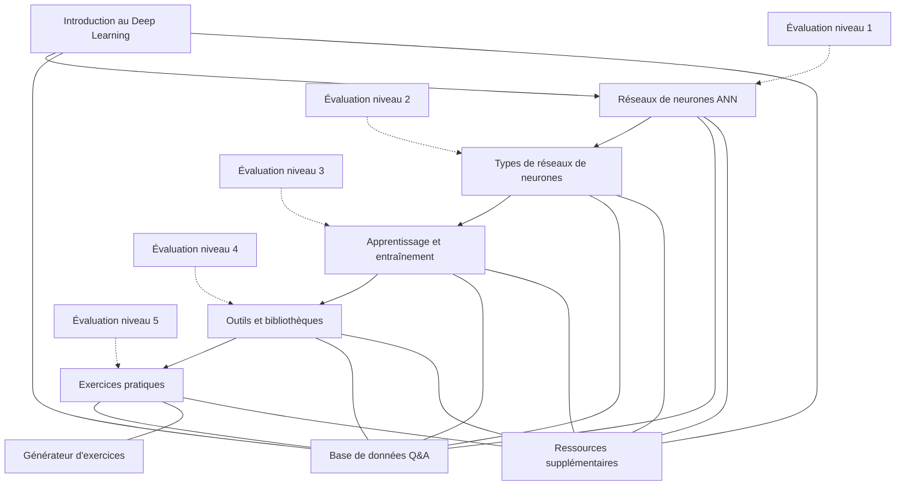

# Présentation du projet fil rouge

## Le chatbot pédagogique sur le Deep Learning

## Vision du projet

Imaginez un assistant virtuel capable d'expliquer les concepts complexes du Deep Learning, de répondre aux questions, de proposer des exercices adaptés et d'accompagner l'apprenant dans sa progression. C'est exactement ce que nous allons créer ensemble au cours de ce parcours !

> 🎯 **Objectif** : Concevoir un chatbot interactif qui aide les étudiants de BTS SIO SLAM à comprendre les concepts du Deep Learning à travers des explications, exemples et exercices.

## Pourquoi ce projet ?

Ce projet fil rouge a été choisi pour plusieurs raisons stratégiques :

1. **Application concrète** : Il permet d'appliquer directement les concepts du Deep Learning à un cas d'usage réel
2. **Dimension méta** : Le chatbot enseigne le Deep Learning en utilisant lui-même des techniques de Deep Learning
3. **Utilité pédagogique** : Le produit final pourra être utilisé comme support d'apprentissage pour d'autres étudiants
4. **Technologies actuelles** : Il intègre l'utilisation d'API modernes comme Mistral AI
5. **Compétences transversales** : Il mobilise des connaissances en développement, IA, pédagogie et conception d'interfaces

## Concepts abordés par le chatbot

Le chatbot que vous développerez devra être capable d'expliquer progressivement les notions suivantes :

1. **Introduction au Deep Learning**
    * Différence entre Machine Learning & Deep Learning
    * Exemples d'applications dans les entreprises

2. **Les réseaux de neurones artificiels (ANN)**
    * Fonctionnement des neurones et couches
    * Rôle des poids et biais

3. **Les types de réseaux de neurones**
    * Réseaux de neurones profonds (DNN)
    * Réseaux convolutifs (CNN – vision par ordinateur)
    * Réseaux récurrents (RNN – traitement de texte)

4. **L'apprentissage et l'entraînement d'un modèle**
    * Propagation avant & rétropropagation
    * Fonction de perte et optimisation

5. **Les outils et bibliothèques**
    * TensorFlow, Keras, PyTorch

6. **Exercices interactifs**
    * QCM, mini-codes à compléter, quiz

## Architecture du projet

Le chatbot s'appuiera sur une architecture modulaire comprenant :

## Intégration de Mistral AI

Une dimension innovante du projet est l'intégration de l'API Mistral AI, un modèle de langage avancé qui permettra d'améliorer significativement les capacités conversationnelles et pédagogiques du chatbot.

Voici comment cette intégration sera développée progressivement :

1. **Séances 1-2**: Fondamentaux et structure, introduction à l'API Mistral AI, test de connexion
2. **Séances 3-4**: Implémentation avancée, prompt engineering, finalisation et optimisation

## Organisation sur 4 séances

Le projet sera développé sur 4 séances de 4 heures chacune :

1. **Introduction au Deep Learning par l'expérimentation** : Fondamentaux, mise en situation pratique, découverte des concepts, exploration des réseaux de neurones
2. **Types de réseaux et leurs applications** : Réseaux convolutifs (CNN) pour la vision, réseaux récurrents (RNN) pour le texte, amélioration itérative des modèles
3. **Optimisation et frameworks** : Techniques d'optimisation, découverte des frameworks (TensorFlow, PyTorch), préparation du projet final
4. **Projet intégrateur** : Développement du chatbot, finalisation, tests, présentation

## Livrables attendus

À la fin du parcours, votre équipe devra remettre :

- **Le code source complet** du chatbot pédagogique
- **La base de connaissances** structurée
- **La documentation technique** expliquant l'architecture
- **Le guide utilisateur** pour une prise en main facile
- **Une présentation** de votre solution

## Compétences développées

Ce projet vous permettra de développer plusieurs compétences essentielles :

| Domaine | Compétences développées |
|---------|-------------------------|
| **Deep Learning** | Compréhension des architectures de réseaux, entraînement de modèles, optimisation |
| **Programmation** | Développement Python, utilisation d'API, gestion de données structurées |
| **Ingénierie NLP** | Traitement du langage naturel, gestion de conversations, prompt engineering |
| **Conception** | Architecture logicielle, modélisation de bases de connaissances |
| **Gestion de projet** | Travail en équipe, planification, documentation |

## Modalités d'évaluation

L'évaluation du projet se fera selon plusieurs dimensions :

- **Qualité du produit final** (fonctionnalités, expérience utilisateur)
- **Exactitude du contenu pédagogique** (précision des explications)
- **Qualité technique** (architecture, optimisation, robustesse)
- **Processus de développement** (organisation, méthodologie)
- **Présentation et documentation** (clarté, exhaustivité)

Consultez la [grille détaillée d'évaluation](evaluation/criteres-evaluation.md) pour plus d'informations.

## Organisation du travail en équipe

Vous travaillerez en équipes de 1-2 étudiants. Pour garantir une répartition équilibrée des tâches, vous utiliserez la [grille de répartition des tâches](evaluation/grille-repartition-taches.md) fournie.

## Prêt à commencer l'aventure ?

Maintenant que vous avez une vision claire du projet fil rouge, découvrez la progression pédagogique qui vous guidera tout au long de ce parcours.

[Voir la carte de progression](carte-progression.md){ .md-button .md-button--primary }
[Commencer la Séance 1](seance1/index.md){ .md-button }