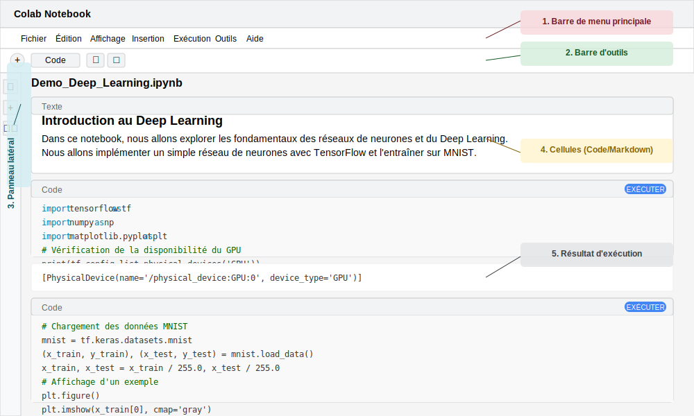

# Guide d'utilisation de Google Colab

## Introduction à Google Colab

Google Colab (ou Colaboratory) est un environnement de notebook Jupyter hébergé par Google. Il permet d'exécuter du code Python dans votre navigateur et est particulièrement adapté au machine learning, à l'analyse de données et à l'éducation.

### Avantages de Google Colab
- **Gratuit** : pas besoin d'installer Python ou des bibliothèques sur votre ordinateur
- **Puissant** : accès à des GPU et TPU gratuits
- **Collaboratif** : facilité de partage et de travail en équipe
- **Prêt à l'emploi** : bibliothèques populaires déjà installées (TensorFlow, PyTorch, etc.)

## Accéder à Google Colab

1. Allez sur [colab.research.google.com](https://colab.research.google.com)
2. Connectez-vous avec votre compte Google
3. Sur la page d'accueil, vous pouvez:
   - Créer un nouveau notebook
   - Ouvrir un notebook existant
   - Accéder à des tutoriels

## Interface de Colab



L'interface de Colab est composée de:

1. **Barre de menu** : Fichier, Édition, Affichage, etc.
2. **Barre d'outils** : actions rapides
3. **Panneau de cellules** : où vous écrivez et exécutez votre code
4. **Panneau latéral** : pour accéder aux fichiers, tableaux, etc.

## Types de cellules

Dans Colab, il existe deux types principaux de cellules:

- **Cellules de code** : pour exécuter du code Python
- **Cellules de texte** : pour écrire des commentaires en Markdown

### Cellules de code

```python
# Exemple de cellule de code
import numpy as np
import matplotlib.pyplot as plt

x = np.linspace(0, 10, 100)
y = np.sin(x)

plt.plot(x, y)
plt.title("Fonction sinus")
plt.show()
```

### Cellules de texte (Markdown)

Les cellules de texte utilisent la syntaxe Markdown:

```markdown
# Titre principal
## Sous-titre

Texte normal avec **texte en gras** et *texte en italique*.

Liste à puces:
- Item 1
- Item 2

Équation mathématique: $y = mx + b$
```

## Exécuter du code

Pour exécuter une cellule:
- Cliquez sur le bouton ▶️ à gauche de la cellule
- Ou utilisez le raccourci clavier `Shift+Enter`

Le résultat s'affiche directement sous la cellule.

## Raccourcis clavier utiles

- `Ctrl+Enter` : Exécuter la cellule
- `Shift+Enter` : Exécuter la cellule et passer à la suivante
- `Alt+Enter` : Exécuter la cellule et insérer une nouvelle cellule en dessous
- `Ctrl+M D` : Supprimer la cellule
- `Ctrl+M A` : Insérer une cellule au-dessus
- `Ctrl+M B` : Insérer une cellule en-dessous
- `Ctrl+M M` : Transformer en cellule Markdown
- `Ctrl+M Y` : Transformer en cellule de code

## Utiliser le GPU/TPU

Pour accélérer l'exécution de votre code:

1. Cliquez sur `Modifier` > `Paramètres du notebook`
2. Sous `Accélérateur matériel`, sélectionnez `GPU` ou `TPU`
3. Cliquez sur `Enregistrer`

## Installer des bibliothèques

Colab possède déjà de nombreuses bibliothèques installées, mais vous pouvez en ajouter d'autres:

```python
!pip install nom_de_la_bibliothèque
```

Exemple:
```python
!pip install transformers
```

Après l'installation, redémarrez l'environnement d'exécution:
1. `Exécution` > `Redémarrer l'environnement d'exécution...`

## Gérer les fichiers

### Importer des fichiers

1. Cliquez sur l'icône 📂 dans le panneau latéral gauche
2. Cliquez sur `Importer` pour télécharger un fichier

Ou via le code:
```python
from google.colab import files
uploaded = files.upload()
```

### Accéder aux fichiers de Google Drive

```python
from google.colab import drive
drive.mount('/content/drive')

# Accéder aux fichiers dans Drive
!ls "/content/drive/My Drive"
```

### Télécharger des fichiers

```python
from google.colab import files
files.download('nom_du_fichier.ext')
```

## Enregistrer votre travail

Colab enregistre automatiquement votre travail dans Google Drive, mais vous pouvez aussi:

1. `Fichier` > `Enregistrer une copie dans Drive`
2. `Fichier` > `Télécharger` > `Télécharger .ipynb`

## Partager un notebook

1. Cliquez sur `Partager` en haut à droite
2. Entrez les adresses e-mail ou obtenez un lien de partage
3. Définissez les autorisations d'accès (Lecteur ou Éditeur)

## Dépannage courant

### Erreur "CUDA out of memory"
- Redémarrez l'environnement d'exécution (Exécution > Redémarrer...)
- Réduisez la taille de votre modèle ou de vos données
- Utilisez un lot (batch) plus petit

### Déconnexion après inactivité
- Colab se déconnecte après environ 90 minutes d'inactivité
- Utilisez `Outils` > `Paramètres` > `Paramètres avancés` > `Désactiver l'interruption après inactivité`

### Limites de temps d'exécution
- Les sessions sont limitées à environ 12 heures
- Pour des calculs plus longs, enregistrez périodiquement votre travail

### Perte de variables
- Si vous exécutez les cellules dans un ordre différent, certaines variables peuvent être perdues
- Mieux vaut exécuter les cellules dans l'ordre séquentiel

## Astuces pour les TPs de Deep Learning

1. **Vérifiez l'accélérateur matériel** avant de commencer un entraînement lourd
   ```python
   import tensorflow as tf
   print("GPU disponible:", tf.config.list_physical_devices('GPU'))
   ```

2. **Sauvegardez vos modèles** régulièrement
   ```python
   model.save('mon_modele.h5')
   ```

3. **Visualisez vos données** avant l'entraînement
   ```python
   import matplotlib.pyplot as plt
   plt.imshow(X_train[0])
   plt.show()
   ```

4. **Utilisez tqdm** pour les barres de progression
   ```python
   !pip install tqdm
   from tqdm.notebook import tqdm
   
   for epoch in tqdm(range(100)):
       # votre boucle d'entraînement
   ```

5. **Profitez de TensorBoard**
   ```python
   %load_ext tensorboard
   %tensorboard --logdir logs
   ```

## Ressources supplémentaires

- [Documentation officielle de Google Colab](https://colab.research.google.com/notebooks/basic_features_overview.ipynb)
- [Tutoriels TensorFlow dans Colab](https://www.tensorflow.org/tutorials)
- [Tutoriels PyTorch dans Colab](https://pytorch.org/tutorials/beginner/colab)

---

Bonne exploration et bon apprentissage du Deep Learning avec Google Colab !