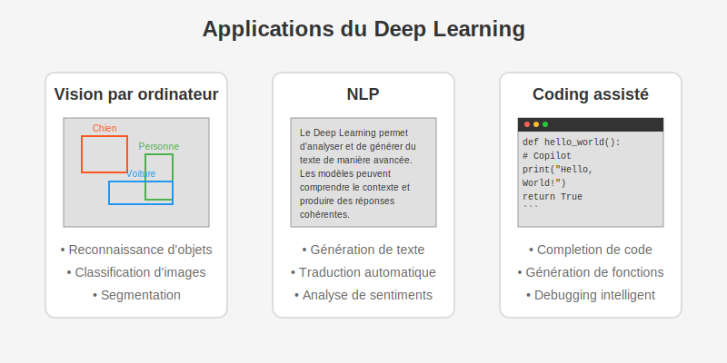

# Phase 1 : Mise en situation pratique (1h)

## Objectif

Découvrir le Deep Learning par la pratique et l'observation, sans vous préoccuper des aspects théoriques qui seront abordés plus tard.

##  [Introduction par l'exemple (15 min) ](demonstrations.md)

- Démonstration 1 : GitHub Copilot (5 min)

-  Démonstration 2 : Reconnaissance d'objets en temps réel (5 min)

-  Démonstration 3 : Génération de texte (5 min)

## Prise en main immédiate (30 min)

### Premier contact avec un réseau de neurones

Colab est un service Jupyter Notebook hébergé qui ne nécessite aucune configuration et offre un accès gratuit aux ressources de calcul, notamment aux GPU et aux TPU. Colab est particulièrement adapté à l'apprentissage automatique, à la science des données et à l'éducation.

###  Instructions détaillées
###  1. Créer un nouveau notebook Colab

Allez sur Google Colab
Cliquez sur "Fichier" > "Nouveau notebook"

### 2. Copier-coller les cellules de code
Dans votre nouveau notebook, vous allez créer 9 cellules en copiant-collant les blocs ci-dessous. Pour chaque cellule :

Cliquez sur "+"
Collez le contenu dans la nouvelle cellule
Exécutez la cellule en cliquant sur le bouton ▶️ ou avec Ctrl+Entrée
Observez les résultats et notez vos observations dans la fiche

### 3. Contenu des cellules à créer
Le fichier premier_contact_reseau_neurones.md contient toutes les cellules de code à copier. Suivez ces cellules dans l'ordre:

- Introduction (cellule Markdown)
- Configuration (cellule Code)
- Chargement des données (cellule Code)
- Création du modèle (cellule Code)
- Entraînement (cellule Code)
- Visualisation (cellule Code)
- Prédictions (cellule Code)
- Dessin interactif (cellule Code)
- Expérimentation (cellule Markdown)

## 4. Remplir la fiche d'observations

- Notez les résultats obtenus à chaque étape
- Réalisez les expérimentations suggérées
- Complétez l'auto-évaluation

## 5. Exploration personnelle

- Modifiez l'architecture du réseau (nombre de filtres, nombre de couches)
- Changez les paramètres d'entraînement (époques, taille de batch)
- Testez le modèle avec vos propres dessins
- Notez l'impact de ces changements

## 6. Rendu final
À la fin de la séance, remettez :

- Votre notebook Colab complété (partagez le lien ou exportez en .ipynb)
- Votre fiche d'observations remplie

## En cas de difficultés

- Référez-vous au guide d'utilisation de Google Colab fourni
- Assurez-vous que les cellules sont exécutées dans l'ordre
- Si une erreur apparaît, lisez attentivement le message et vérifiez votre code

## Fichiers fournis

- [premier_contact_reseau_neurones.md](premier_contact_reseau_neurones.md) : Contient toutes les cellules de code à copier-coller
- [fiche-observations-bts-sio.md](fiche-observations-bts-sio.md) : Document à remplir pendant l'exercice
- [guide_utilisation_colab.md](guide_utilisation_colab.md) : Aide pour les débutants sur Google Colab

