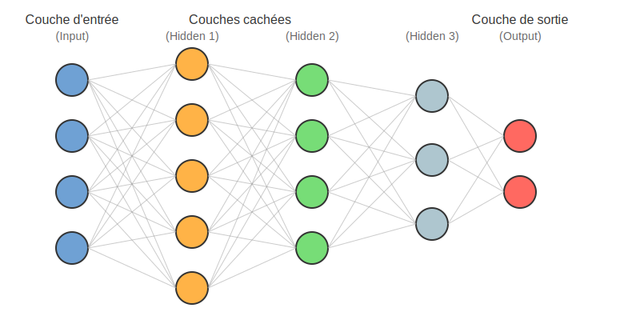
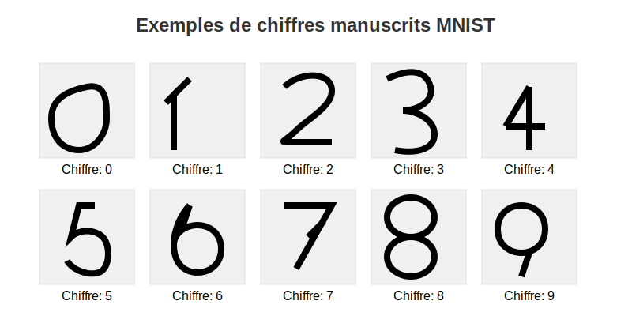

# Deep Learning en action
## Applications concrètes et démonstrations

---

## Qu'est-ce que le Deep Learning ?

- Sous-domaine du Machine Learning
- Utilise des réseaux de neurones à plusieurs couches
- Apprend automatiquement les caractéristiques importantes des données
- Particulièrement performant sur les données complexes (images, texte, son)

---

## Pourquoi le Deep Learning change la donne

- Capacité à traiter des données non structurées (texte, image, son)
- Performances supérieures sur des tâches complexes
- Extraction automatique des caractéristiques pertinentes
- Apprentissage de bout en bout (end-to-end learning)

---

## Applications que nous allons explorer aujourd'hui

1. **GitHub Copilot** : Assistant de programmation IA
2. **Reconnaissance d'objets** : Détection et classification d'objets dans des images
3. **Génération de texte** : Création automatique de contenu textuel cohérent

- Tester ses performances et l'optimiser

---

## Objectifs de l'exercice pratique

1. Se familiariser avec les outils (Google Colab, TensorFlow/Keras)
2. Comprendre les étapes de création et d'entraînement d'un modèle
3. Observer l'impact des paramètres sur les performances
4. Visualiser le processus d'apprentissage en action

---

## Commencer l'exercice pratique →

[Mise en situation du Deep Learning](partie1-mise-en-situation.md)

Bon apprentissage !