# Carte de progression

## GPS pédagogique : votre itinéraire d'apprentissage du Deep Learning

Cette carte de progression vous permettra de visualiser clairement les objectifs, les activités et les compétences développées à chaque étape de votre formation en Deep Learning.

## Parcours global

```mermaid
gantt
    title Parcours d'apprentissage du Deep Learning
    dateFormat  D
    axisFormat %d
    tickInterval 1day
    
    section Fondamentaux
    Séance 1: Introduction au Deep Learning    :s1, 0, 1d
    
    section Architectures
    Séance 2: Types de réseaux et applications    :s2, after s1, 1d
    
    section Outils & Techniques
    Séance 3: Frameworks et préparation du projet    :s3, after s2, 1d
    
    section Projet Final
    Séance 4: Développement et présentation du chatbot    :s4, after s3, 1d
    
    section Compétences
    Concepts fondamentaux    :crit, active, c1, 0, 4d
    Programmation TensorFlow/Keras    :active, c2, 0, 4d
    Intégration API    :active, c3, after s2, 2d
    Développement web    :active, c4, after s1, 3d
```

## Progression détaillée des compétences

Le tableau ci-dessous détaille l'évolution des compétences techniques et conceptuelles que vous développerez au cours de cette formation :

| Compétence | Séance 1 | Séance 2 | Séance 3 | Séance 4 |
|------------|----------|----------|----------|----------|
| **Compréhension des réseaux de neurones** |  |  |  |  |
| **Programmation avec TensorFlow/Keras** |  |  |  |  |
| **Visualisation et analyse de données** |  |  |  |  |
| **Traitement d'images** |  |  |  |  |
| **Traitement du texte** |  |  |  |  |
| **Développement web** |  |  |  |  |
| **Conception et architecture** |  |  |  |  |
| **Développement collaboratif** |  |  |  |  |

## Parcours d'apprentissage visuel

```mermaid
flowchart LR
    subgraph S1["Séance 1: Introduction"]
        F["Fondamentaux\nRéseaux de neurones"]
        DL["ML classique vs\nDeep Learning"]
        E["Expérimentation\nnotebook MNIST"]
    end
    
    subgraph S2["Séance 2: Architectures"]
        CNN["Réseaux convolutifs\nVision par ordinateur"]
        RNN["Réseaux récurrents\nTraitement du texte"]
        AM["Challenge\nd'amélioration"]
    end
    
    subgraph S3["Séance 3: Outils"]
        FW["Frameworks\nTensorFlow/Keras"]
        OP["Optimisation\ndes performances"]
        API["API Mistral\nPrompt engineering"]
    end
    
    subgraph S4["Séance 4: Projet"]
        DEV["Développement\ndu chatbot"]
        TEST["Finalisation\net tests"]
        PRES["Présentation\nfinale"]
    end
    
    S1 --> S2
    S2 --> S3
    S3 --> S4
    
    style S1 fill:#e1f5fe,stroke:#0288d1
    style S2 fill:#e8f5e9,stroke:#388e3c
    style S3 fill:#fff8e1,stroke:#ffa000
    style S4 fill:#ffebee,stroke:#d32f2f
```

## Détail des séances et objectifs pédagogiques

### Mode de travail par séance

| Séance | Mode de travail | Commentaires |
|--------|-----------------|--------------|
| Séance 1 | Individuel | Exploration personnelle, avec partage possible en groupe |
| Séance 2 | Individuel, puis binôme pour le challenge | Mini-projets individuels, challenge d'amélioration en binôme |  
| Séance 3 | Binôme | Formation des équipes projet (1-2 personnes) et préparation |
| Séance 4 | Binôme | Développement, finalisation et présentation en équipe |

### Séance 1 : Introduction au Deep Learning par l'expérimentation

**Objectifs pédagogiques :**

 - Découvrir le Deep Learning par des manipulations concrètes
 - Comprendre les différences fondamentales entre ML classique et DL
 - Explorer le fonctionnement interne d'un réseau de neurones simple
 - Acquérir le vocabulaire technique de base

**Activités :**

 - Mise en situation pratique : démonstrations et notebook "Hello World" *(travail individuel)*
 - Découverte comparative : ML classique vs Deep Learning *(travail individuel)*
 - Exploration guidée : anatomie d'un réseau de neurones *(travail individuel)*
 - Synthèse et auto-évaluation *(travail individuel)*

**Compétences BTS SIO développées :**

 - B1.3 : Gestion des données d'images pour les modèles
 - B2.2 : Conception de modèles simples
 - B3.2 : Évaluation de la performance des modèles

**Livrables :**

 - Fiche d'observations complétée
 - Tableau comparatif ML vs DL
 - Schéma annoté d'un réseau de neurones

### Séance 2 : Types de réseaux et leurs applications

**Objectifs pédagogiques :**

 - Maîtriser les principes des réseaux convolutifs (CNN)
 - Comprendre le fonctionnement des réseaux récurrents (RNN)
 - Implémenter des modèles pour différents types de données
 - Visualiser et interpréter le fonctionnement des modèles

**Activités :**

 - Mini-projet CNN : classification d'images et visualisation *(travail individuel)*
 - Mini-projet RNN : traitement de texte et prédiction de séquences *(travail individuel)*
 - Challenge d'amélioration : optimisation collaborative d'un modèle *(travail en binôme)*

**Compétences BTS SIO développées :**

 - B1.3 : Traitement de données complexes (images, textes)
 - B2.2 : Développement de modèles spécialisés
 - B2.3 : Création d'interfaces simples pour les modèles
 - B3.2 : Analyse comparative des performances

**Livrables :**

 - Modèle CNN fonctionnel avec visualisations
 - Modèle RNN pour analyse de texte
 - Rapport d'amélioration documenté

### Séance 3 : Frameworks pratiques et préparation du projet

**Objectifs pédagogiques :**

 - Maîtriser les frameworks de Deep Learning courants
 - Optimiser les performances des modèles
 - Découvrir l'API Mistral AI pour les applications conversationnelles
 - Préparer le projet de chatbot pédagogique

**Activités :**

 - Frameworks en pratique : utilisation efficace de TensorFlow/Keras *(travail en binôme)*
 - Optimisation de modèles : techniques d'amélioration des performances *(travail en binôme)*
 - Introduction à Mistral AI : premiers pas avec l'API *(travail en binôme)*
 - Conception du chatbot : préparation de l'architecture et des fonctionnalités *(travail en binôme)*

**Compétences BTS SIO développées :**

 - B1.4 : Exploitation des API et interfaces de programmation
 - B2.2 : Optimisation de solutions applicatives
 - B3.2 : Vérification et amélioration des performances

**Livrables :**

 - Applications fonctionnelles avec TensorFlow/Keras
 - Premier test d'intégration avec l'API Mistral
 - Document de conception du chatbot

### Séance 4 : Projet intégrateur - Chatbot pédagogique

**Objectifs pédagogiques :**

 - Mettre en œuvre l'ensemble des connaissances acquises
 - Développer une application conversationnelle complète
 - Structurer une base de connaissances pédagogique
 - Présenter et défendre un projet technique

**Activités :**

 - Développement du chatbot : interface et backend *(travail en binôme)*
 - Intégration de l'API Mistral et de la base de connaissances *(travail en binôme)*
 - Tests et optimisation de l'expérience utilisateur *(travail en binôme)*
 - Préparation et réalisation de la présentation finale *(travail en binôme)*

**Compétences BTS SIO développées :**

 - B1.4 : Exploitation avancée des API
 - B2.2/B2.3 : Développement d'une solution applicative complète
 - B3.2/B3.3 : Tests, documentation et présentation technique

**Livrables :**

 - Code source complet du chatbot
 - Documentation technique et guide utilisateur
 - Présentation et démonstration du projet

## Points de contrôle de votre progression

### Après la Séance 1
- [ ] Je comprends ce qu'est un réseau de neurones
- [ ] Je sais expliquer la différence entre ML classique et Deep Learning
- [ ] J'ai réussi à manipuler un modèle simple sur MNIST

### Après la Séance 2
- [ ] Je comprends ce qu'est un CNN et son application en vision par ordinateur
- [ ] Je comprends ce qu'est un RNN et son application en traitement de texte
- [ ] J'ai réussi à améliorer un modèle existant

### Après la Séance 3
- [ ] Je sais utiliser TensorFlow/Keras pour créer un modèle simple
- [ ] Je connais les techniques d'optimisation des performances
- [ ] J'ai réussi à faire un premier test avec l'API Mistral

### Après la Séance 4
- [ ] J'ai développé un chatbot pédagogique fonctionnel
- [ ] J'ai intégré une base de connaissances structurée
- [ ] J'ai présenté mon projet de manière claire et convaincante

## Conseil pour optimiser votre apprentissage

1. **Expérimentez régulièrement** avec les exemples de code fournis
2. **Posez des questions** dès qu'un concept n'est pas clair
3. **Collaborez** avec vos pairs pour résoudre les problèmes complexes
4. **Documentez** votre progression et vos découvertes
5. **Établissez des liens** entre les différents concepts et technologies

Cette formation est conçue comme un parcours progressif où chaque séance s'appuie sur les acquis des précédentes. Suivez le chemin balisé tout en explorant les possibilités qui vous intéressent particulièrement.

[Retour à l'accueil](index.md){ .md-button }
[Voir la présentation du projet](presentation.md){ .md-button }
[Commencer la Séance 1](seance1/index.md){ .md-button .md-button--primary }