# Carte de progression

## GPS pédagogique : votre itinéraire d'apprentissage

Cette carte de progression vous permettra de visualiser clairement les objectifs, les activités et les compétences développées à chaque étape de votre formation en Deep Learning.

## Parcours global

```mermaid
gantt
    title Progression pédagogique du parcours Deep Learning
    dateFormat HH:mm
    axisFormat %Hh%M
    
    section Séance 1
    Introduction expérimentale au Deep Learning    :s1, 00:00, 4h
    
    section Séance 2
    Types de réseaux et applications      :s2, after s1, 4h
    
    section Séance 3
    Frameworks et préparation du projet   :s3, after s2, 4h
    
    section Séance 4
    Développement et présentation du chatbot   :s4, after s3, 4h
```

## Progression détaillée des compétences

Le tableau ci-dessous détaille l'évolution des compétences techniques et conceptuelles que vous développerez au cours de cette formation :

| Compétence | Séance 1 | Séance 2 | Séance 3 | Séance 4 |
|------------|----------|----------|----------|----------|
| **Compréhension des réseaux de neurones** | Fondamentaux, structure de base | Architectures spécialisées (CNN, RNN) | Applications pratiques | Intégration complète |
| **Programmation avec TensorFlow/Keras** | Premiers pas guidés | Mini-projets spécifiques | Optimisation de modèles | Application avancée |
| **Visualisation et analyse de données** | Métriques de base | Feature maps et visualisations avancées | Évaluation des performances | Dashboard intégré |
| **Traitement d'images** | Classification simple | CNN complets et transfer learning | - | - |
| **Traitement du texte** | - | RNN pour séquences | Intégration API Mistral | Système conversationnel complet |
| **Développement web** | - | Interface web simple | API REST | Application complète |
| **Conception et architecture** | - | - | Préparation du projet | Implémentation avancée |
| **Développement collaboratif** | Activités guidées | Challenge d'amélioration | Planification | Réalisation en équipe |

## Détail des séances et objectifs pédagogiques

### Séance 1 : Introduction au Deep Learning par l'expérimentation

**Objectifs pédagogiques :**

 - Découvrir le Deep Learning par des manipulations concrètes
 - Comprendre les différences fondamentales entre ML classique et DL
 - Explorer le fonctionnement interne d'un réseau de neurones simple
 - Acquérir le vocabulaire technique de base

**Activités :**

 - Mise en situation pratique : démonstrations et notebook "Hello World"
 - Découverte comparative : ML classique vs Deep Learning
 - Exploration guidée : anatomie d'un réseau de neurones
 - Synthèse et auto-évaluation

**Compétences BTS SIO développées :**

 - B1.3 : Gestion des données d'images pour les modèles
 - B2.2 : Conception de modèles simples
 - B3.2 : Évaluation de la performance des modèles

**Livrables :**

 - Fiche d'observations complétée
 - Tableau comparatif ML vs DL
 - Schéma annoté d'un réseau de neurones

### Séance 2 : Types de réseaux et leurs applications

**Objectifs pédagogiques :**

 - Maîtriser les principes des réseaux convolutifs (CNN)
 - Comprendre le fonctionnement des réseaux récurrents (RNN)
 - Implémenter des modèles pour différents types de données
 - Visualiser et interpréter le fonctionnement des modèles

**Activités :**

 - Mini-projet CNN : classification d'images et visualisation
 - Mini-projet RNN : traitement de texte et prédiction de séquences
 - Challenge d'amélioration : optimisation collaborative d'un modèle

**Compétences BTS SIO développées :**

 - B1.3 : Traitement de données complexes (images, textes)
 - B2.2 : Développement de modèles spécialisés
 - B2.3 : Création d'interfaces simples pour les modèles
 - B3.2 : Analyse comparative des performances

**Livrables :**

 - Modèle CNN fonctionnel avec visualisations
 - Modèle RNN pour analyse de texte
 - Rapport d'amélioration documenté

### Séance 3 : Frameworks pratiques et préparation du projet

**Objectifs pédagogiques :**

 - Maîtriser les frameworks de Deep Learning courants
 - Optimiser les performances des modèles
 - Découvrir l'API Mistral AI pour les applications conversationnelles
 - Préparer le projet de chatbot pédagogique

**Activités :**

 - Frameworks en pratique : utilisation efficace de TensorFlow/Keras
 - Optimisation de modèles : techniques d'amélioration des performances
 - Introduction à Mistral AI : premiers pas avec l'API
 - Conception du chatbot : préparation de l'architecture et des fonctionnalités

**Compétences BTS SIO développées :**

 - B1.4 : Exploitation des API et interfaces de programmation
 - B2.2 : Optimisation de solutions applicatives
 - B3.2 : Vérification et amélioration des performances

**Livrables :**

 - Applications fonctionnelles avec TensorFlow/Keras
 - Premier test d'intégration avec l'API Mistral
 - Document de conception du chatbot

### Séance 4 : Projet intégrateur - Chatbot pédagogique

**Objectifs pédagogiques :**

 - Mettre en œuvre l'ensemble des connaissances acquises
 - Développer une application conversationnelle complète
 - Structurer une base de connaissances pédagogique
 - Présenter et défendre un projet technique

**Activités :**

 -  Développement du chatbot : interface et backend
 - Intégration de l'API Mistral et de la base de connaissances
 - Tests et optimisation de l'expérience utilisateur
 - Préparation et réalisation de la présentation finale

**Compétences BTS SIO développées :**

 - B1.4 : Exploitation avancée des API
 - B2.2/B2.3 : Développement d'une solution applicative complète
 - B3.2/B3.3 : Tests, documentation et présentation technique

**Livrables :**

 - Code source complet du chatbot
 - Documentation technique et guide utilisateur
 - Présentation et démonstration du projet

## Système d'évaluation

L'évaluation de cette formation est conçue pour refléter à la fois les compétences techniques acquises et la capacité à les appliquer dans un projet concret.

### Répartition de la note finale

| Composante | Pondération | Description |
|------------|-------------|-------------|
| Participation active | 10% | Engagement dans les activités, pertinence des contributions |
| Mini-projets | 30% | Qualité des livrables des séances 2 et 3 |
| Projet final - Produit | 30% | Fonctionnalité et qualité technique du chatbot |
| Projet final - Processus | 15% | Organisation, méthodologie, répartition des tâches |
| Projet final - Présentation | 15% | Qualité de la présentation et de la documentation |

### Critères d'évaluation détaillés

Chaque composante est évaluée selon des critères spécifiques :

**Mini-projets (30%) :**
 - Respect des consignes techniques
 - Fonctionnalité et performances des modèles
 - Qualité du code et de la documentation
 - Analyse critique des résultats

**Projet final (60% au total) :**
 - **Produit (30%)** : Fonctionnalités implémentées, qualité technique, expérience utilisateur
 - **Processus (15%)** : Organisation de l'équipe, gestion du temps, adaptation aux difficultés
 - **Présentation (15%)** : Clarté de l'exposé, démonstration, réponses aux questions

Pour plus de détails sur les critères d'évaluation, consultez la [grille d'évaluation complète](evaluation/criteres-evaluation.md).

## Ressources d'apprentissage

Pour faciliter votre progression, diverses ressources sont mises à votre disposition :

 - **Notebooks Jupyter** : Exercices guidés et exemples de code
 - **Documentation technique** : API Mistral, TensorFlow/Keras, Flask/FastAPI
 - **Base de connaissances** : Glossaires, schémas explicatifs, ressources pédagogiques
 - **Templates de code** : Structures de base pour les différents projets

Accédez à toutes ces ressources dans la [section dédiée](ressources/index.md).

## Conseil pour optimiser votre apprentissage

1. **Expérimentez régulièrement** avec les exemples de code fournis
2. **Posez des questions** dès qu'un concept n'est pas clair
3. **Collaborez** avec vos pairs pour résoudre les problèmes complexes
4. **Documentez** votre progression et vos découvertes
5. **Établissez des liens** entre les différents concepts et technologies

Cette formation est conçue comme un parcours progressif où chaque séance s'appuie sur les acquis des précédentes. Suivez le chemin balisé tout en explorant les possibilités qui vous intéressent particulièrement.

[Retour à l'accueil](index.md){ .md-button }
[Voir la présentation du projet](presentation.md){ .md-button }
[Commencer la Séance 1](seance1/index.md){ .md-button .md-button--primary }