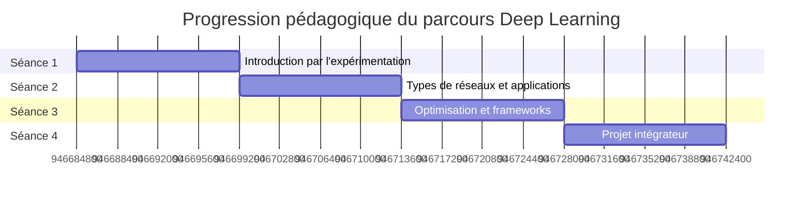

# Carte de progression

## GPS pédagogique : votre itinéraire d'apprentissage

Cette carte de progression vous guidera à travers les 4 séances de formation, en vous permettant de visualiser clairement les objectifs, les activités et les compétences développées à chaque étape.

## Vue d'ensemble du parcours

## Séance 1 : Introduction au Deep Learning par l'expérimentation

### Objectifs pédagogiques

- Découvrir le Deep Learning par des démonstrations et manipulations concrètes
- Comprendre les différences fondamentales entre Machine Learning classique et Deep Learning
- Explorer le fonctionnement interne d'un réseau de neurones
- Acquérir le vocabulaire technique de base du Deep Learning

### Activités

- **Mise en situation pratique** (1h) : Démonstrations, prise en main sur Google Colab
- **Découverte des concepts** (1h30) : Comparaison ML vs DL, exploration de notebooks
- **TP guidé** (1h15) : Anatomie d'un réseau de neurones, manipulation des composants
- **Débrief** (15min) : Synthèse des concepts clés

### Livrables

- Fiches d'observations complétées
- Tableau comparatif ML vs DL
- Schéma annoté d'un réseau de neurones

## Séance 2 : Types de réseaux et leurs applications

**Durée** : 4 heures

### Objectifs pédagogiques

- Comprendre les architectures CNN pour la vision par ordinateur
- Explorer les réseaux RNN pour le traitement des séquences
- Appliquer ces connaissances à des cas d'usage concrets
- Développer une approche d'amélioration itérative des modèles

### Activités

- **Mini-projet CNN** (1h30) : Exploration d'un réseau convolutif, classification d'images
- **Mini-projet RNN** (1h30) : Manipulation d'un réseau récurrent, traitement de séquences
- **Challenge d'amélioration** (1h) : Optimisation d'un modèle en équipe

### Livrables

- Modèle CNN fonctionnel avec visualisations
- Modèle RNN/LSTM avec analyse des performances
- Rapport d'amélioration documentant les expérimentations

## Séance 3 : Optimisation et frameworks

**Durée** : 4 heures

### Objectifs pédagogiques

- Maîtriser les techniques d'optimisation des réseaux de neurones
- Découvrir les principaux frameworks de Deep Learning
- Préparer la conception du projet final (chatbot pédagogique)
- S'initier à l'API Mistral AI pour la génération de texte

### Activités

- **Projet d'optimisation** (1h30) : Rétropropagation, comparaison d'optimiseurs
- **Découverte des frameworks** (1h30) : TensorFlow/Keras vs PyTorch
- **Préparation au projet final** (1h) : Cahier des charges, formation des équipes

### Livrables

- Rapport d'optimisation avec analyse comparative
- Modèle implémenté dans deux frameworks différents
- Document de conception initiale du chatbot pédagogique

## Séance 4 : Projet intégrateur

**Durée** : 4 heures

### Objectifs pédagogiques

- Appliquer l'ensemble des connaissances acquises à un projet concret
- Développer un chatbot pédagogique fonctionnel
- Intégrer l'API Mistral AI dans une solution complète
- Présenter et défendre un projet technique

### Activités

- **Développement du chatbot** (2h30) : Base de connaissances, implémentation, intégration API
- **Finalisation et tests** (1h) : Tests, optimisation, documentation
- **Présentation des projets** (30min) : Démonstration par équipe

### Livrables

- Code source complet du chatbot pédagogique
- Documentation technique et guide utilisateur
- Présentation du projet
- Base de connaissances structurée sur le Deep Learning

## Progression des compétences

| Compétence | Séance 1 | Séance 2 | Séance 3 | Séance 4 |
|------------|----------|----------|----------|----------|
| Deep Learning | Introduction | Architectures | Optimisation | Application |
| Programmation | Notebooks | Implémentation | Frameworks | Application |
| Visualisation | Outils basiques | Feature maps | Outils avancés | Intégration |
| Optimisation | - | Ajustements | Techniques | Application |
| NLP | - | RNN basiques | API Mistral | Chatbot |
| Travail en équipe | Binômes | Groupes | Planification | Projet |

## Évaluation

| Composante | % | Description |
|------------|---|-------------|
| Participation | 10% | Engagement et contributions |
| Mini-projets | 30% | Livrables des séances 2-3 |
| Projet - Produit | 30% | Fonctionnalité du chatbot |
| Projet - Processus | 15% | Organisation, méthodologie |
| Projet - Présentation | 15% | Présentation et documentation |

[Commencer la Séance 1](seance1/index.md){ .md-button .md-button--primary }