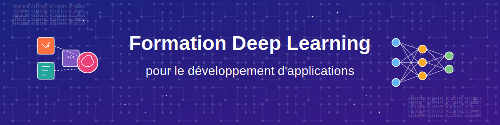
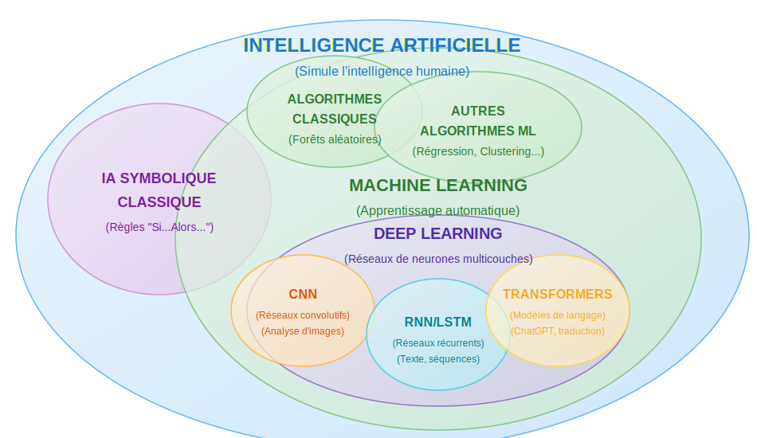
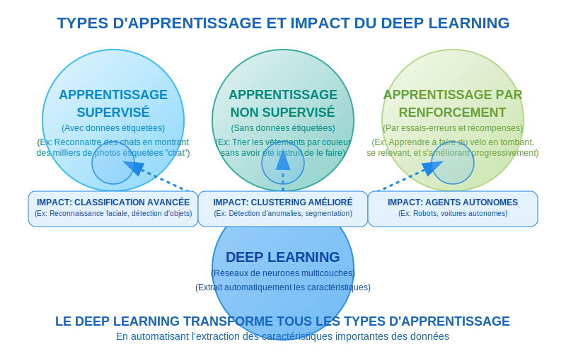
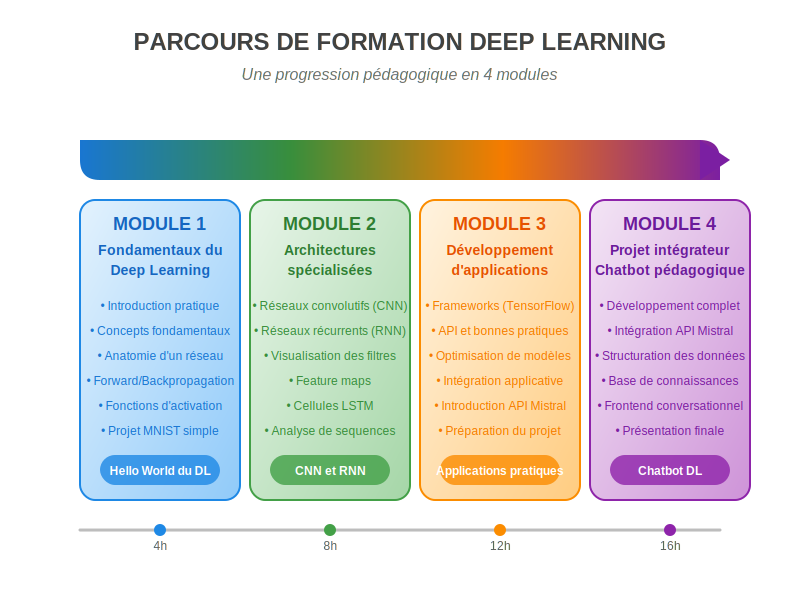

# Formation Deep Learning pour BTS SIO

## 🚀 Bienvenue dans ce parcours d'apprentissage

Cette formation intensive vous initie au **Deep Learning** à travers une approche pratique et progressive, spécialement conçue pour les étudiants de **BTS SIO**. Vous découvrirez les **fondamentaux des réseaux de neurones**, explorerez différentes **architectures spécialisées**, et développerez un **chatbot pédagogique** intégrant l'**API Mistral AI**.

## 🧠 Qu'est-ce que le Deep Learning ?

Le **Deep Learning** est une branche du **Machine Learning** qui utilise des **réseaux de neurones à multiples couches** pour extraire automatiquement des caractéristiques hiérarchiques à partir des données. Contrairement au Machine Learning classique qui nécessite une extraction manuelle des caractéristiques, le Deep Learning **automatise ce processus**, le rendant particulièrement efficace pour des tâches complexes comme la **vision par ordinateur** et le **traitement du langage naturel**.

- Après avoir exploré le paysage de l'**Intelligence Artificielle** et situé le Deep Learning dans cet écosystème, examinons maintenant son impact sur les différentes méthodes d'apprentissage automatique. Contrairement à ce qu'on pourrait penser, le Deep Learning n'est pas un type d'apprentissage isolé, mais une **approche révolutionnaire** qui s'applique aux trois paradigmes fondamentaux : l'**apprentissage supervisé**, **non supervisé** et par **renforcement**. 

- Comme l'illustre le schéma suivant, le Deep Learning agit comme un **amplificateur** qui transforme radicalement les capacités de chacune de ces méthodes, permettant de résoudre des problèmes jusqu'alors hors de portée des approches traditionnelles.

## 📚 Organisation du parcours

## 🛠️ Prérequis techniques

Pour suivre efficacement cette formation, vous devez :

- Posséder des bases en **programmation Python**
- Disposer d'un compte Google pour accéder à **Google Colab**
- Avoir une curiosité pour l'intelligence artificielle

##  📌 Documentation de référence

- **[Glossaire du Deep Learning](module1/ressources/glossaire-dl.md)** - Les termes essentiels expliqués simplement
- **[Compétences BTS SIO développées](ressources/competences-stage-sio.md)** - Consultez les compétences professionnelles visées

## 🚀 Commencer votre parcours

Prêt à vous lancer dans l'univers du Deep Learning ? Deux options s'offrent à vous :

[🤖 Découvrir le projet chatbot](presentation.md){ .md-button }
[🏁 Commencer le Module 1](module1/index.md){ .md-button .md-button--primary }