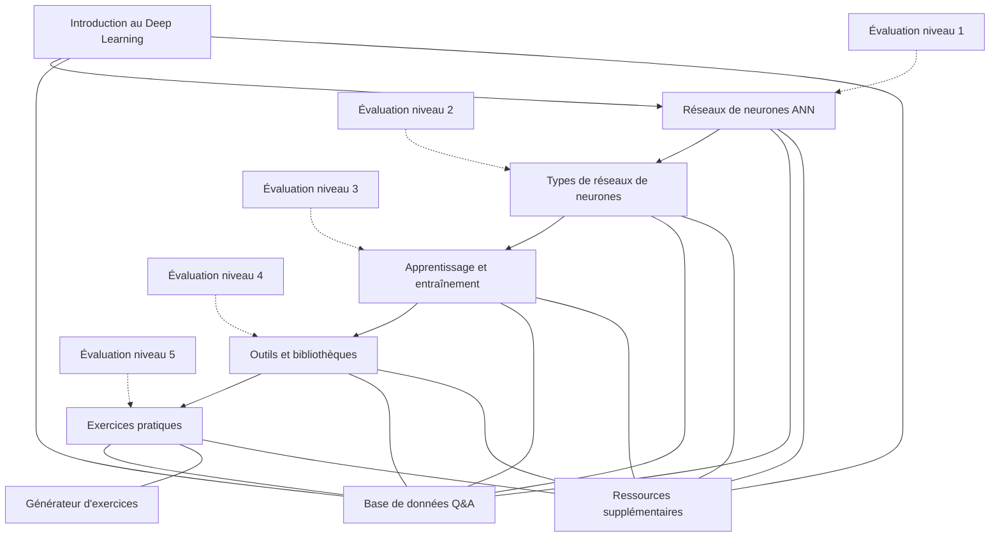

# Chatbot pédagogique pour le Deep Learning

## Bienvenue dans ce parcours sur le Deep Learning !

Ce cours vous permettra de découvrir et d'appliquer les technologies de Deep Learning, avec une approche pratique et progressive adaptée aux étudiants de BTS SIO . Plutôt que de commencer par la théorie abstraite, vous explorerez les concepts à travers des démonstrations concrètes et des manipulations directes.

## Projet fil rouge : Chatbot pédagogique

🤖 Tout au long de ce parcours, vous développerez un **chatbot pédagogique** capable d'expliquer les concepts du Deep Learning. Ce projet fil rouge vous permettra d'appliquer directement les connaissances acquises et de créer un outil concret utilisant l'IA avancée.

> 🎯 **Objectif** : Concevoir un chatbot interactif qui aide les étudiants à comprendre les concepts du Deep Learning à travers des explications, exemples et exercices.

-  **4 séances intensives**

    ---
    
    * 4 heures par séance
    * Alternance entre théorie et pratique
    * Expérimentations progressives
    * Évaluations intermédiaires
    
-  **Compétences développées**

    ---
    
    * Maîtrise des frameworks principaux (TensorFlow, Keras)
    * Conception de réseaux de neurones
    * Optimisation des modèles
    * Intégration d'IA dans des applications

-  **Technologies utilisées**

    ---
    
    * API Mistral AI
    * Google Colab pour l'expérimentation
    * Frameworks de Deep Learning
    * Techniques de traitement du langage naturel
    

## Structure du cours

Notre progression a été pensée pour construire vos compétences de manière cohérente et graduelle :

### [Séance 1 : Introduction au Deep Learning par l'expérimentation](seance1/index.md)
- Découverte du Deep Learning par des démonstrations et manipulations concrètes
- Comparaison entre Machine Learning classique et Deep Learning
- Exploration du fonctionnement interne d'un réseau de neurones
- Mini-projet collaboratif et débrief assisté par IA

### [Séance 2 : Types de réseaux et leurs applications](seance2/index.md)
- Réseaux de neurones convolutifs (CNN) pour la vision par ordinateur
- Réseaux récurrents (RNN) pour le traitement des séquences
- Mini-projets pratiques sur les architectures spécifiques
- Challenge d'amélioration d'un modèle en groupe

### [Séance 3 : Optimisation et frameworks](seance3/index.md)
- Techniques d'optimisation des réseaux de neurones
- Rétropropagation et descente de gradient
- Découverte de TensorFlow/Keras et PyTorch
- Préparation du projet final (chatbot pédagogique)

### [Séance 4 : Projet intégrateur](seance4/index.md)
- Application de l'ensemble des connaissances acquises
- Développement du chatbot pédagogique
- Intégration de l'API Mistral AI
- Présentation et défense du projet

## Compétences développées

Ce cours développe des compétences essentielles du référentiel BTS SIO  :

| Compétence | Description | Activités associées |
|------------|-------------|---------------------|
| **B1.3** | Gestion des données | Manipulation des datasets d'images et de texte |
| **B1.4** | Exploitation des standards | Utilisation des API REST, frameworks standard |
| **B2.2** | Conception de solutions applicatives | Développement de modèles et prototypes |
| **B2.3** | Développement | Intégration des modèles ML dans des applications |
| **B3.2** | Vérification et validation | Tests et optimisation des modèles |
| **B3.3** | Documentation technique | Documentation des implémentations |

## Progression des compétences

Le tableau ci-dessous vous permet de visualiser la progression des compétences développées tout au long du parcours :

| Compétence | Séance 1 | Séance 2 | Séance 3 | Séance 4 |
|------------|----------|----------|----------|----------|
| Compréhension du Deep Learning | Introduction | Architectures spécifiques | Optimisation | Application complète |
| Programmation Python | Notebooks basiques | Implémentation modèles | Frameworks | Application complète |
| Visualisation et analyse | Outils basiques | Filtres et feature maps | Outils avancés | Intégration |
| Optimisation de modèles | - | Premiers ajustements | Techniques avancées | Application réelle |
| Traitement du langage | - | RNN basiques | API Mistral | Chatbot complet |
| Travail en équipe | Binômes | Groupes | Planification | Projet complet |

## Modalités d'évaluation

L'évaluation globale du parcours se décompose ainsi :

- **Participation active** (10%) : Engagement dans les activités, pertinence des contributions
- **Mini-projets** (30%) : Qualité des livrables pour les mini-projets des séances 2 et 3
- **Projet final - Produit** (30%) : Fonctionnalité et qualité technique du chatbot
- **Projet final - Processus** (15%) : Organisation, méthodologie, répartition des tâches
- **Projet final - Présentation** (15%) : Qualité de la présentation et de la documentation

## Prérequis

Pour suivre cette formation, vous devez :

- Avoir des connaissances de base en programmation Python
- Comprendre les principes fondamentaux des algorithmes
- Disposer d'un compte Google pour utiliser Google Colab
- Avoir une curiosité pour l'intelligence artificielle et ses applications

💡**Conseil**
    Même si vous n'avez pas toutes les connaissances préalables, la nature pratique de cette formation vous permettra d'apprendre progressivement. N'hésitez pas à poser des questions et à expérimenter !

## Ressources complémentaires

En plus des contenus structurés par séance, vous trouverez dans cet atelier :

- Des [notebooks Jupyter](ressources/notebooks/) pour l'expérimentation (outil pour l'expérimentation et l'analyse de données)
- Une [base de connaissances](ressources/base-connaissances.md) sur le Deep Learning
- La [documentation de l'API Mistral](ressources/api-mistral.md)
- Des [schémas JSON](ressources/json-schemas.md) pour la structuration des données

## Démarrage rapide

Vous êtes prêt à plonger dans le monde fascinant du Deep Learning ? Commencez par la première séance pour découvrir les concepts fondamentaux à travers des démonstrations et expérimentations concrètes.

[Débuter avec la première séance](seance1/index.md){ .md-button .md-button--primary }
[Consulter le projet fil rouge](presentation.md){ .md-button }