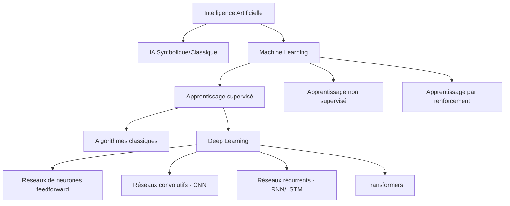

Voici une proposition de structure pour la page d'accueil du cours, avec une organisation plus claire des différentes sections :

# Formation Deep Learning

## Bienvenue dans ce parcours d'apprentissage

Cette formation intensive vous initie au Deep Learning à travers une approche pratique et progressive, spécialement conçue pour les étudiants de BTS SIO.

## 1. Le Deep Learning dans l'écosystème de l'IA

### 1.1 Hiérarchie conceptuelle

- **L'Intelligence Artificielle** englobe toutes les techniques permettant aux machines de simuler l'intelligence humaine
- Le **Machine Learning** est un sous-ensemble de l'IA où les systèmes apprennent à partir des données sans être explicitement programmés
- Le **Deep Learning** constitue une branche spécialisée du Machine Learning, s'appuyant sur des réseaux de neurones à multiples couches (d'où le terme "deep")

### 1.2 Impact sur les métiers de l'informatique

Pour les futurs professionnels du BTS SIO, comprendre le Deep Learning est particulièrement pertinent car cette technologie transforme de nombreux aspects des métiers de l'informatique :

* **Développement d'applications** : Intégration de fonctionnalités intelligentes (reconnaissance d'images, traitement du langage naturel, etc.)
  
* **Sécurité informatique** : Détection d'anomalies et d'intrusions, analyse de comportements suspects
  
* **Maintenance prédictive** : Anticiper les défaillances des systèmes informatiques
  
* **Support utilisateur** : Chatbots et assistants virtuels pour automatiser le support de niveau 1
  
* **Analyse de données** : Extraction automatique d'insights à partir de grands volumes de données

### 1.3 Spécificité et avantages du Deep Learning

Ce qui rend le Deep Learning particulièrement puissant pour un professionnel SIO, c'est qu'il automatise l'extraction des caractéristiques pertinentes, là où les méthodes traditionnelles nécessitent un travail manuel d'ingénierie des caractéristiques (feature engineering). Cette capacité ouvre des possibilités d'application dans de nombreux domaines que vous rencontrerez dans votre parcours professionnel :

- **Pour l'option SISR** : détection d'intrusions réseau, prévision de charge serveur, analyse automatisée des logs système
- **Pour l'option SLAM** : intégration d'API de vision par ordinateur, création d'assistants virtuels, analyse prédictive dans les applications métier

## 2. Organisation du parcours

Notre formation se compose de 4 modules de 4 heures chacun :

| Module | Titre | Aperçu |
|--------|-------|--------|
| [Module 1](module1/index.md) | **Fondamentaux du Deep Learning** | Introduction pratique, concepts fondamentaux, anatomie des réseaux de neurones |
| [Module 2](module2/index.md) | **Architectures spécialisées** | Réseaux convolutifs (CNN) pour la vision, réseaux récurrents (RNN) pour le texte |
| [Module 3](module3/index.md) | **Développement d'applications pratiques** | Frameworks, optimisation, intégration API, préparation au projet |
| [Module 4](module4/index.md) | **Projet intégrateur - Chatbot pédagogique** | Développement du chatbot, finalisation, présentation |

## 3. Prérequis techniques

Pour suivre efficacement cette formation, vous devez :

 - Posséder des bases en programmation Python
 - Disposer d'un compte Google pour accéder à Colab
 - Avoir une curiosité pour l'intelligence artificielle

## 4. Navigation dans ce site

Ce site contient toutes les ressources nécessaires pour votre parcours :

- **[Carte de progression](carte-progression.md)** - Parcours d'apprentissage et compétences développées
- [Guide de bonnes pratiques pour la documentation technique](ressources/guide-etudiant.md)
- [Compétences recherchées en stage BTS SIO](ressources/competences-stage-sio.md)

## 5. Ressources supplémentaires

- **Documentation TensorFlow/Keras** - [tensorflow.org/tutorials](https://www.tensorflow.org/tutorials)
- **API Mistral** - [docs.mistral.ai](https://docs.mistral.ai/)
- **Hugging Face** - [huggingface.co/docs](https://huggingface.co/docs)
- **FastAPI** - [fastapi.tiangolo.com](https://fastapi.tiangolo.com/)

## 6. Commencer votre parcours

Prêt à vous lancer dans l'univers du Deep Learning ? Deux options s'offrent à vous :

[Découvrir le projet chatbot](presentation.md){ .md-button }
[Commencer le Module 1](module1/index.md){ .md-button .md-button--primary }

Cette structure réorganisée présente plusieurs avantages :

1. **Hiérarchie claire** : La numérotation des sections principales (1, 2, 3...) et sous-sections (1.1, 1.2, 1.3...) permet une navigation plus intuitive et une meilleure compréhension de l'organisation du contenu.

2. **Regroupement logique** : Les informations sur le Deep Learning sont regroupées dans une section principale (section 1) avec trois sous-sections complémentaires qui explorent différentes facettes du sujet.

3. **Progression naturelle** : La structure guide naturellement le lecteur depuis les concepts théoriques jusqu'à l'application pratique, en passant par l'organisation du cours et les prérequis.

4. **Accessibilité visuelle** : Les espaces entre les sections et la hiérarchisation claire permettent une meilleure lisibilité et facilitent la recherche d'informations spécifiques.

5. **Cohérence du contenu** : Chaque section principale a un objectif distinct et couvre un aspect spécifique de la formation, ce qui rend la page plus cohérente et facile à comprendre.