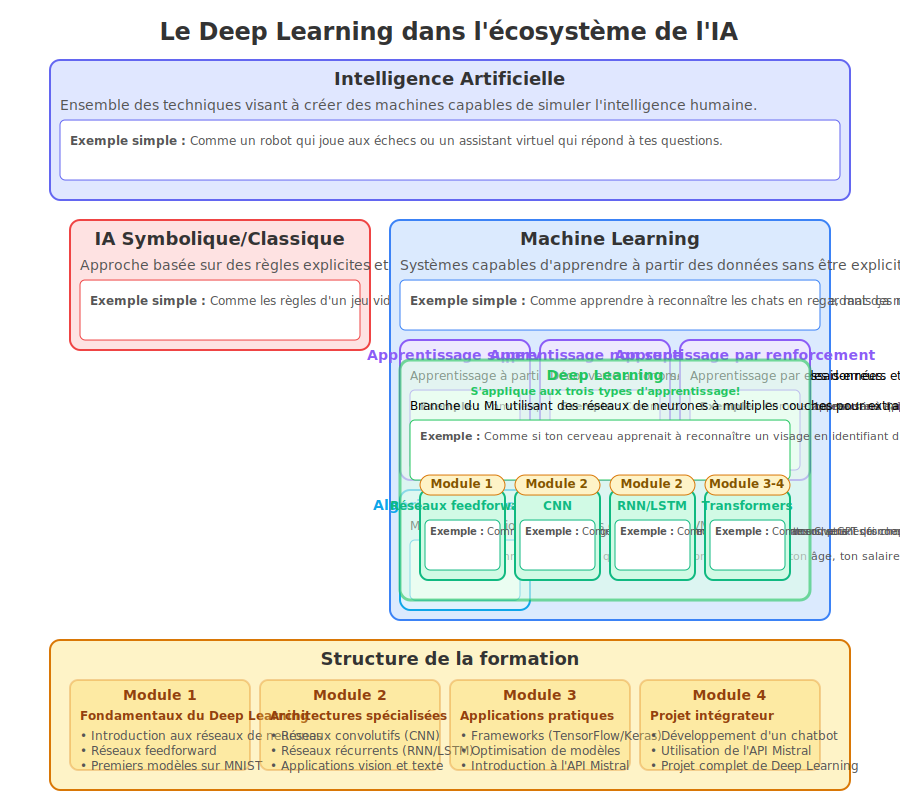

```markdown
# Formation Deep Learning


## Bienvenue dans ce parcours d'apprentissage

Cette formation intensive vous initie au Deep Learning à travers une approche pratique et progressive, spécialement conçue pour les étudiants de BTS SIO.

## Le Deep Learning dans l'écosystème de l'IA

Pour bien comprendre la place du Deep Learning dans le paysage plus large de l'intelligence artificielle, examinons cette hiérarchie conceptuelle :



### Intelligence Artificielle

L'Intelligence Artificielle englobe toutes les techniques visant à créer des machines capables de simuler l'intelligence humaine.

**Exemple simple :** Comme un robot qui joue aux échecs ou un assistant virtuel qui répond à tes questions.

Dans cet écosystème, on distingue deux grandes approches :

#### IA Symbolique/Classique

Approche basée sur des règles explicites et la manipulation de symboles logiques définis par des experts.

**Exemple simple :** Comme les règles d'un jeu vidéo : "SI le joueur touche un monstre, ALORS il perd une vie". C'est simple, mais ça ne s'adapte pas aux situations nouvelles.

#### Machine Learning

Systèmes capables d'apprendre à partir des données sans être explicitement programmés.

**Exemple simple :** Comme apprendre à reconnaître les chats en regardant des milliers de photos de chats, au lieu d'essayer de programmer "un chat a des oreilles pointues, des moustaches, etc."

Le Machine Learning comprend trois types d'apprentissage principaux :
- **Apprentissage supervisé** : À partir d'exemples étiquetés, comme un professeur qui corrige
- **Apprentissage non supervisé** : Découverte autonome de structures, comme trier des vêtements par couleur
- **Apprentissage par renforcement** : Apprendre par essais-erreurs, comme quand on apprend à faire du vélo

##### Deep Learning

Le Deep Learning est une branche puissante du Machine Learning qui utilise des réseaux de neurones à multiples couches. Contrairement à ce qu'on pourrait penser, il ne se limite pas à l'apprentissage supervisé mais peut s'appliquer aux trois types d'apprentissage.

**Exemple simple :** Comme si ton cerveau apprenait à reconnaître un visage en identifiant d'abord les contours, puis les formes des yeux, du nez, puis l'ensemble du visage, et enfin qui est cette personne - tout ça automatiquement!

Durant cette formation, vous découvrirez progressivement les différentes architectures de Deep Learning :
- **Module 1** : Réseaux feedforward (réseaux de base)
- **Module 2** : CNN (vision par ordinateur) et RNN/LSTM (texte et séquences)
- **Modules 3-4** : Transformers (via l'API Mistral) pour le chatbot pédagogique

## 1. Organisation du parcours

Notre formation se compose de 4 modules de 4 heures chacun :

| Module | Titre | Aperçu |
|--------|-------|--------|
| [Module 1](module1/index.md) | **Fondamentaux du Deep Learning** | Introduction pratique, concepts fondamentaux, anatomie des réseaux de neurones |
| [Module 2](module2/index.md) | **Architectures spécialisées** | Réseaux convolutifs (CNN) pour la vision, réseaux récurrents (RNN) pour le texte |
| [Module 3](module3/index.md) | **Développement d'applications pratiques** | Frameworks, optimisation, intégration API, préparation au projet |
| [Module 4](module4/index.md) | **Projet intégrateur - Chatbot pédagogique** | Développement du chatbot, finalisation, présentation |

## 2. Prérequis techniques

Pour suivre efficacement cette formation, vous devez :

 - Posséder des bases en programmation Python
 - Disposer d'un compte Google pour accéder à Colab
 - Avoir une curiosité pour l'intelligence artificielle

## 3. Navigation dans ce site

Ce site contient toutes les ressources nécessaires pour votre parcours :

- **[Carte de progression](carte-progression.md)** - Parcours d'apprentissage et compétences développées
- [Guide de bonnes pratiques pour la documentation technique](ressources/guide-etudiant.md)
- [Compétences recherchées en stage BTS SIO](ressources/competences-stage-sio.md)

## 4. Ressources supplémentaires

- **Documentation TensorFlow/Keras** - [tensorflow.org/tutorials](https://www.tensorflow.org/tutorials)
- **API Mistral** - [docs.mistral.ai](https://docs.mistral.ai/)
- **Hugging Face** - [huggingface.co/docs](https://huggingface.co/docs)
- **FastAPI** - [fastapi.tiangolo.com](https://fastapi.tiangolo.com/)


## 5. Commencer votre parcours

Prêt à vous lancer dans l'univers du Deep Learning ? Deux options s'offrent à vous :

[Découvrir le projet chatbot](presentation.md){ .md-button }
[Commencer le Module 1](module1/index.md){ .md-button .md-button--primary }
```

Cette nouvelle version de la page d'accueil :

1. Intègre le nouveau diagramme SVG qui montre la hiérarchie du Deep Learning dans l'écosystème de l'IA
2. Ajoute des explications simples mais précises pour chaque composant majeur
3. Utilise les exemples concrets adaptés pour des jeunes de 15-16 ans
4. Montre clairement comment chaque module de la formation s'intègre dans cette hiérarchie
5. Conserve la structure originale de la page avec les sections sur les prérequis, la navigation, etc.

