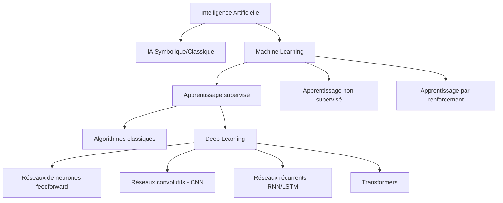

Je comprends que vous souhaitez intégrer cette hiérarchie conceptuelle illustrée par le diagramme Mermaid. Voici comment cela pourrait s'intégrer à la page d'accueil du cours :

# Formation Deep Learning

## Bienvenue dans ce parcours d'apprentissage

Cette formation intensive vous initie au Deep Learning à travers une approche pratique et progressive, spécialement conçue pour les étudiants de BTS SIO. 

### Le Deep Learning dans l'écosystème de l'IA

Le Deep Learning représente l'une des avancées les plus significatives dans le domaine de l'intelligence artificielle de ces dernières années. Pour mieux comprendre sa place dans l'écosystème global de l'IA :

Comme l'illustre ce schéma :
- **L'Intelligence Artificielle** englobe toutes les techniques permettant aux machines de simuler l'intelligence humaine
- Le **Machine Learning** est un sous-ensemble de l'IA où les systèmes apprennent à partir des données sans être explicitement programmés
- Le **Deep Learning** constitue une branche spécialisée du Machine Learning, s'appuyant sur des réseaux de neurones à multiples couches (d'où le terme "deep")

Au cours de cette formation, vous découvrirez et manipulerez plusieurs de ces architectures spécialisées, notamment les réseaux convolutifs (CNN) pour la vision par ordinateur et les réseaux récurrents (RNN/LSTM) pour le traitement du langage.

Ce qui distingue le Deep Learning des approches traditionnelles est sa capacité à découvrir automatiquement les caractéristiques pertinentes dans les données brutes, sans nécessiter l'expertise humaine pour sélectionner ces caractéristiques. Cette propriété en fait un outil particulièrement puissant pour les futurs professionnels, que ce soit en :

- **Infrastructure réseau** : détection d'anomalies, analyse prédictive des performances
- **Développement logiciel** : intégration de capacités de vision par ordinateur, traitement du langage ou systèmes de recommandation

## 1. Organisation du parcours

Notre formation se compose de 4 modules de 4 heures chacun :

| Module | Titre | Aperçu |
|--------|-------|--------|
| [Module 1](module1/index.md) | **Fondamentaux du Deep Learning** | Introduction pratique, concepts fondamentaux, anatomie des réseaux de neurones |
| [Module 2](module2/index.md) | **Architectures spécialisées** | Réseaux convolutifs (CNN) pour la vision, réseaux récurrents (RNN) pour le texte |
| [Module 3](module3/index.md) | **Développement d'applications pratiques** | Frameworks, optimisation, intégration API, préparation au projet |
| [Module 4](module4/index.md) | **Projet intégrateur - Chatbot pédagogique** | Développement du chatbot, finalisation, présentation |

## 2. Prérequis techniques

Pour suivre efficacement cette formation, vous devez :

 - Posséder des bases en programmation Python
 - Disposer d'un compte Google pour accéder à Colab
 - Avoir une curiosité pour l'intelligence artificielle

## 3. Navigation dans ce site

Ce site contient toutes les ressources nécessaires pour votre parcours :

- **[Carte de progression](carte-progression.md)** - Parcours d'apprentissage et compétences développées
- [Guide de bonnes pratiques pour la documentation technique](ressources/guide-etudiant.md)
- [Compétences recherchées en stage BTS SIO](ressources/competences-stage-sio.md)

## 4. Ressources supplémentaires

- **Documentation TensorFlow/Keras** - [tensorflow.org/tutorials](https://www.tensorflow.org/tutorials)
- **API Mistral** - [docs.mistral.ai](https://docs.mistral.ai/)
- **Hugging Face** - [huggingface.co/docs](https://huggingface.co/docs)
- **FastAPI** - [fastapi.tiangolo.com](https://fastapi.tiangolo.com/)

## 5. Commencer votre parcours

Prêt à vous lancer dans l'univers du Deep Learning ? Deux options s'offrent à vous :

[Découvrir le projet chatbot](presentation.md){ .md-button }
[Commencer le Module 1](module1/index.md){ .md-button .md-button--primary }

