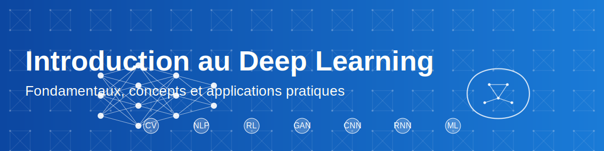

Voici la mise en forme corrigée avec les retours à la ligne appropriés :
# Introduction pratique au Deep Learning

## Objectifs de cette section

Dans cette première approche du Deep Learning, vous allez :

 - Découvrir des applications concrètes et impressionnantes du Deep Learning
 - Manipuler votre premier réseau de neurones sans prérequis théoriques
 - Expérimenter l'impact des modifications sur les performances d'un modèle
 - Développer une intuition sur le fonctionnement des réseaux de neurones

## Approche pédagogique : d'abord la pratique, ensuite la théorie

Contrairement à l'approche traditionnelle qui commence par la théorie, nous allons d'abord vous faire manipuler des modèles de Deep Learning pour éveiller votre curiosité et vous donner une intuition pratique. Les concepts théoriques seront introduits progressivement, en s'appuyant sur votre expérience directe.

## Phase 1 : Applications du Deep Learning (15 min)

### Démonstration 1 : GitHub Copilot

GitHub Copilot est un assistant de programmation basé sur un modèle de Deep Learning. Il analyse le contexte de votre code et suggère des compléments pertinents.

**Comment ça fonctionne :**

 - Entraîné sur des millions de dépôts GitHub publics
 - Utilise un modèle de langage basé sur des architectures avancées
 - Analyse le contexte (code existant, commentaires, noms de fonctions)
 - Génère des suggestions pertinentes en temps réel

**Exemple pratique :**

 - Écriture d'une fonction à partir d'un simple commentaire
 - Complétion de code automatique
 - Génération de tests unitaires

### Démonstration 2 : Reconnaissance d'objets en temps réel

La reconnaissance d'objets est l'une des applications les plus visibles du Deep Learning. Nous utiliserons l'application [Teachable Machine](https://teachablemachine.withgoogle.com/) pour une démonstration en direct.

**Points à observer :**

 - Détection en temps réel d'objets présents dans la salle
 - Niveau de confiance (pourcentage) pour chaque prédiction
 - Robustesse face aux variations (angle, éclairage)

**Comment ça fonctionne :**

 - Utilise des réseaux de neurones convolutifs (CNN)
 - Détecte des caractéristiques visuelles à différents niveaux d'abstraction
 - Identifie et localise les objets dans l'image

### Démonstration 3 : Génération de texte

Les modèles de langage comme GPT ou Mistral peuvent générer du texte cohérent et contextuellement pertinent sur pratiquement n'importe quel sujet.

**Expérimentation :**

 - Essai de différentes amorces (technique, créative, formelle)
 - Observation de l'adaptation au style et au contexte
 - Analyse de la cohérence des textes générés

**Applications professionnelles :**

 - Génération automatique de descriptions de produits
 - Création d'assistants virtuels pour guider les utilisateurs
 - Production de résumés de documents techniques
 - Suggestions de réponses dans une application de service client

## Phase 2 : Premier contact avec un réseau de neurones (30 min)

### Instructions détaillées

#### 1. Création d'un notebook dans Google Colab

Google Colab est un environnement Jupyter Notebook hébergé qui permet d'exécuter du code Python dans le cloud, sans installation locale.

1. Ouvrez [Google Colab](https://colab.research.google.com/)
2. Connectez-vous avec votre compte Google
3. Cliquez sur "Fichier" > "Nouveau notebook"

#### 2. Exploration du "Hello World du Deep Learning"

Le "Hello World" du Deep Learning est la reconnaissance de chiffres manuscrits avec le dataset MNIST. Vous allez implémenter un réseau de neurones simple capable de reconnaître des chiffres écrits à la main.

Suivez ces étapes :

 - Copier-coller les cellules depuis le [notebook de référence](ressources/hello-world-dl.md)
 - Exécuter chaque cellule en cliquant sur le bouton ▶️ ou avec Ctrl+Entrée
 - Observer et analyser les résultats à chaque étape
 - Compléter la [fiche d'observations](ressources/fiche-observations.md)

#### 3. Structure du notebook

Le notebook est organisé en plusieurs sections pour vous guider :

1. **Introduction** - Présentation du problème de reconnaissance de chiffres
2. **Configuration** - Importation des bibliothèques nécessaires
3. **Chargement des données** - Préparation du dataset MNIST
4. **Création du modèle** - Architecture du réseau de neurones
5. **Entraînement** - Processus d'apprentissage du modèle
6. **Visualisation** - Graphiques d'évolution de l'apprentissage
7. **Prédictions** - Test du modèle sur de nouvelles données
8. **Dessin interactif** - Interface pour tester avec vos propres dessins
9. **Expérimentation** - Suggestions de modifications à essayer

#### 4. Expérimentations guidées

Après avoir exécuté le notebook de base, essayez ces modifications pour observer leur impact :

1. **Modification de l'architecture :**

     - Augmenter/diminuer le nombre de neurones dans chaque couche
     - Ajouter ou supprimer des couches dans le réseau
     - Essayer d'ajouter une couche Dropout (qui désactive aléatoirement certains neurones pendant l'entraînement)

2. **Ajustement des paramètres d'entraînement :**

     - Changer le nombre de cycles d'entraînement (époques)
     - Modifier le nombre d'exemples traités à la fois (taille du batch)
     - Tester différentes méthodes d'apprentissage (optimiseurs)

3. **Test avec vos propres dessins :**

     - Utiliser l'interface de dessin pour tester des chiffres manuscrits
     - Observer comment le modèle réagit à différents styles d'écriture
     - Analyser les prédictions erronées et tenter de comprendre pourquoi

## Phase 3 : Réflexion et documentation (15 min)

Après vos expérimentations, prenez le temps de réfléchir à ce que vous avez observé :

1. **Complétez la fiche d'observations :**

   - Notez les performances initiales du modèle
   - Documentez l'impact de vos modifications
   - Analysez les cas où le modèle échoue

2. **Questions de réflexion :**

   - Qu'est-ce qui semble avoir le plus d'impact sur les performances ?
   - Quelles sont les limites du modèle que vous avez observées ?
   - Quelles applications pratiques pourriez-vous envisager avec cette technologie ?

3. **Partage d'expérience :**

   - Échangez avec vos camarades sur vos observations
   - Comparez les résultats de vos différentes modifications
   - Discutez des surprises ou des difficultés rencontrées

## Conclusion et transition

Cette introduction pratique vous a permis de manipuler directement un réseau de neurones sans vous préoccuper immédiatement des concepts théoriques sous-jacents. Vous avez pu observer comment un modèle apprend à reconnaître des chiffres manuscrits et comment diverses modifications peuvent affecter ses performances.

Dans la prochaine section, nous approfondirons les [concepts fondamentaux](concepts-fondamentaux.md) du Deep Learning en nous appuyant sur votre expérience pratique. Nous comparerons également le Deep Learning avec les approches classiques du Machine Learning pour mieux comprendre ses particularités et ses avantages.

## Ressources complémentaires

 - [Guide d'utilisation de Google Colab](ressources/guide-colab.md) - Pour vous aider à utiliser cet environnement
 - [Glossaire du Deep Learning](ressources/glossaire-dl.md) - Définitions des termes techniques rencontrés
 - [TensorFlow Playground](https://playground.tensorflow.org/) - Interface interactive pour expérimenter avec des réseaux de neurones simples

[Retour au Module 1](index.md){ .md-button }
[Continuer vers les Concepts fondamentaux](concepts-fondamentaux.md){ .md-button .md-button--primary }
