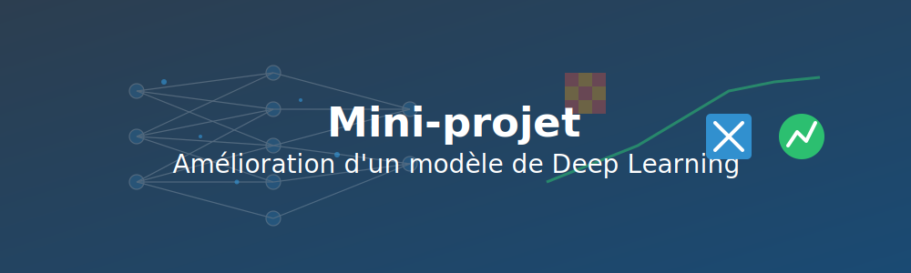

# Mini-projet individuel : Amélioration d'un modèle de Deep Learning



## Objectifs

Ce mini-projet individuel vous permettra de :

- Appliquer les connaissances acquises sur les réseaux de neurones
- Expérimenter avec différentes architectures et hyperparamètres
- Développer une méthode d'analyse des performances
- Documenter vos résultats de façon professionnelle

## Contexte

Vous êtes stagiaire dans une entreprise qui souhaite implémenter un système de reconnaissance automatique de chiffres manuscrits pour traiter des formulaires papier. Un premier modèle a été développé, mais sa précision est encore insuffisante pour une utilisation en production.

Votre mission est d'améliorer ce modèle existant en explorant différentes configurations et en justifiant vos choix techniques.

## Instructions détaillées

### Étape 1 : Préparation de l'environnement (5 min)

1. Créez un nouveau notebook dans Google Colab
2. Importez les bibliothèques nécessaires :
   ```python
   import numpy as np
   import matplotlib.pyplot as plt
   import tensorflow as tf
   from tensorflow.keras.datasets import mnist
   from tensorflow.keras.models import Sequential
   from tensorflow.keras.layers import Dense, Dropout, Flatten, Conv2D, MaxPooling2D
   from tensorflow.keras.utils import to_categorical
   ```

3. Chargez et préparez les données MNIST :
   ```python
   # Chargement des données
   (X_train, y_train), (X_test, y_test) = mnist.load_data()
   
   # Normalisation et reshaping
   X_train = X_train.reshape(-1, 28, 28, 1) / 255.0
   X_test = X_test.reshape(-1, 28, 28, 1) / 255.0
   
   # Conversion des labels en catégories
   y_train_cat = to_categorical(y_train, 10)
   y_test_cat = to_categorical(y_test, 10)
   ```

### Étape 2 : Implémentation du modèle de référence (10 min)

Le modèle de référence fourni par l'entreprise est un CNN simple :

```python
def create_baseline_model():
    model = Sequential([
        Conv2D(32, kernel_size=(3, 3), activation='relu', input_shape=(28, 28, 1)),
        MaxPooling2D(pool_size=(2, 2)),
        Conv2D(64, kernel_size=(3, 3), activation='relu'),
        MaxPooling2D(pool_size=(2, 2)),
        Flatten(),
        Dense(128, activation='relu'),
        Dense(10, activation='softmax')
    ])
    
    model.compile(
        optimizer='adam',
        loss='categorical_crossentropy',
        metrics=['accuracy']
    )
    
    return model

# Créer et entraîner le modèle de référence
baseline_model = create_baseline_model()
baseline_history = baseline_model.fit(
    X_train, y_train_cat,
    epochs=5,
    batch_size=128,
    validation_split=0.2,
    verbose=1
)

# Évaluer le modèle de référence
baseline_score = baseline_model.evaluate(X_test, y_test_cat, verbose=0)
print(f"Modèle de référence - Précision: {baseline_score[1]*100:.2f}%")
```

### Étape 3 : Analyse et modifications (30 min)

Votre tâche consiste à améliorer ce modèle de référence. Expérimentez avec au moins trois des modifications suivantes :

1. **Modification de l'architecture**
     - Ajouter/enlever des couches de convolution
     - Modifier le nombre de filtres
     - Changer la taille des noyaux de convolution

2. **Techniques de régularisation**
     - Ajouter des couches de Dropout
     - Utiliser de la régularisation L1/L2
     - Implémenter du Batch Normalization

3. **Optimisation des hyperparamètres**
     - Tester différents optimiseurs (SGD, RMSprop, Adam)
     - Modifier le taux d'apprentissage
     - Varier la taille du batch

4. **Augmentation de données**
     - Rotation des images
     - Zoom
     - Décalage

5. **Stratégies d'entraînement**
   - Modifier le nombre d'époques
   - Utiliser un learning rate scheduler
   - Implémenter early stopping

Pour chaque modification, créez une fonction qui retourne le modèle modifié :

```python
def create_improved_model_1():
    # Votre implémentation avec la première modification
    model = Sequential([
        # Votre architecture modifiée
    ])
    
    model.compile(
        optimizer='adam',
        loss='categorical_crossentropy',
        metrics=['accuracy']
    )
    
    return model

# Similairement pour les autres modifications
```

### Étape 4 : Évaluation comparative (10 min)

Créez une fonction d'évaluation pour comparer systématiquement vos modèles :

```python
def evaluate_model(model_creator, model_name, epochs=5):
    model = model_creator()
    
    # Mesurer le temps d'entraînement
    import time
    start_time = time.time()
    
    # Entraîner le modèle
    history = model.fit(
        X_train, y_train_cat,
        epochs=epochs,
        batch_size=128,
        validation_split=0.2,
        verbose=1
    )
    
    training_time = time.time() - start_time
    
    # Évaluer sur l'ensemble de test
    test_score = model.evaluate(X_test, y_test_cat, verbose=0)
    test_accuracy = test_score[1]
    
    # Visualiser l'évolution de l'apprentissage
    plt.figure(figsize=(12, 4))
    plt.subplot(1, 2, 1)
    plt.plot(history.history['accuracy'], label='Train')
    plt.plot(history.history['val_accuracy'], label='Validation')
    plt.title(f'{model_name} - Précision')
    plt.xlabel('Époque')
    plt.ylabel('Précision')
    plt.legend()
    
    plt.subplot(1, 2, 2)
    plt.plot(history.history['loss'], label='Train')
    plt.plot(history.history['val_loss'], label='Validation')
    plt.title(f'{model_name} - Perte')
    plt.xlabel('Époque')
    plt.ylabel('Perte')
    plt.legend()
    
    plt.tight_layout()
    plt.show()
    
    # Retourner les métriques principales
    return {
        'accuracy': test_accuracy,
        'training_time': training_time,
        'history': history.history
    }

# Évaluer tous les modèles
baseline_results = evaluate_model(create_baseline_model, "Modèle de référence")
model1_results = evaluate_model(create_improved_model_1, "Modèle amélioré 1")
# ... évaluez vos autres modèles
```

### Étape 5 : Analyse des erreurs (5 min)

Pour mieux comprendre les forces et faiblesses de vos modèles, analysez les erreurs de classification :

```python
def analyze_errors(model, name):
    # Obtenir les prédictions
    predictions = model.predict(X_test)
    pred_classes = np.argmax(predictions, axis=1)
    true_classes = np.argmax(y_test_cat, axis=1)
    
    # Identifier les erreurs
    misclassified = np.where(pred_classes != true_classes)[0]
    
    if len(misclassified) > 0:
        # Afficher quelques exemples mal classés
        plt.figure(figsize=(12, 4))
        for i, idx in enumerate(misclassified[:10]):
            plt.subplot(2, 5, i+1)
            plt.imshow(X_test[idx].reshape(28, 28), cmap='gray')
            plt.title(f"Réel: {true_classes[idx]}\nPrédit: {pred_classes[idx]}")
            plt.axis('off')
        plt.suptitle(f"Erreurs de classification - {name}")
        plt.tight_layout()
        plt.show()
    
    # Calculer le taux d'erreur par chiffre
    error_by_digit = {}
    for digit in range(10):
        digit_indices = np.where(true_classes == digit)[0]
        if len(digit_indices) > 0:
            digit_errors = np.sum(pred_classes[digit_indices] != digit)
            error_rate = digit_errors / len(digit_indices)
            error_by_digit[digit] = error_rate
    
    # Afficher un graphique des taux d'erreur par chiffre
    plt.figure(figsize=(10, 5))
    digits = list(error_by_digit.keys())
    error_rates = [error_by_digit[d] for d in digits]
    plt.bar(digits, error_rates)
    plt.title(f"Taux d'erreur par chiffre - {name}")
    plt.xlabel("Chiffre")
    plt.ylabel("Taux d'erreur")
    plt.xticks(range(10))
    plt.ylim(0, max(error_rates) * 1.2)
    plt.grid(axis='y', alpha=0.3)
    plt.show()

# Analyser les erreurs du meilleur modèle
analyze_errors(best_model, "Meilleur modèle")
```

### Étape 6 : Généralisations et robustesse (5 min)

Testez la robustesse de votre meilleur modèle face à des données altérées :

```python
def test_robustness(model, name):
    # Créer des versions bruitées et rotées des images de test
    noisy_X_test = X_test + np.random.normal(0, 0.1, X_test.shape)
    noisy_X_test = np.clip(noisy_X_test, 0, 1)  # S'assurer que les valeurs restent entre 0 et 1
    
    from scipy.ndimage import rotate
    rotated_X_test = np.zeros_like(X_test)
    for i in range(len(X_test)):
        angle = np.random.uniform(-15, 15)
        rotated_X_test[i, :, :, 0] = rotate(X_test[i, :, :, 0], angle, reshape=False)
    
    # Évaluer sur les données altérées
    normal_score = model.evaluate(X_test, y_test_cat, verbose=0)[1]
    noisy_score = model.evaluate(noisy_X_test, y_test_cat, verbose=0)[1]
    rotated_score = model.evaluate(rotated_X_test, y_test_cat, verbose=0)[1]
    
    # Afficher les résultats
    print(f"Performances du modèle {name}:")
    print(f"- Données normales: {normal_score*100:.2f}%")
    print(f"- Données bruitées: {noisy_score*100:.2f}%")
    print(f"- Données rotées: {rotated_score*100:.2f}%")
    
    # Visualiser quelques exemples
    plt.figure(figsize=(15, 5))
    for i in range(5):
        # Image originale
        plt.subplot(3, 5, i+1)
        plt.imshow(X_test[i].reshape(28, 28), cmap='gray')
        plt.axis('off')
        if i == 2:
            plt.title("Images originales")
        
        # Image bruitée
        plt.subplot(3, 5, i+6)
        plt.imshow(noisy_X_test[i].reshape(28, 28), cmap='gray')
        plt.axis('off')
        if i == 2:
            plt.title("Images bruitées")
        
        # Image rotée
        plt.subplot(3, 5, i+11)
        plt.imshow(rotated_X_test[i].reshape(28, 28), cmap='gray')
        plt.axis('off')
        if i == 2:
            plt.title("Images rotées")
    
    plt.tight_layout()
    plt.show()

# Tester la robustesse du meilleur modèle
test_robustness(best_model, "Meilleur modèle")
```

### Étape 7 : Comparaison finale et documentation (5 min)

Créez un tableau récapitulatif de tous les modèles testés :

```python
def compare_models(results_dict):
    # Créer un tableau comparatif
    models = list(results_dict.keys())
    metrics = ['accuracy', 'training_time']
    
    # Afficher le tableau
    print("-" * 60)
    print(f"{'Modèle':<25} {'Précision':<15} {'Temps (s)':<15}")
    print("-" * 60)
    
    for model_name in models:
        acc = results_dict[model_name]['accuracy'] * 100
        time = results_dict[model_name]['training_time']
        print(f"{model_name:<25} {acc:<15.2f} {time:<15.2f}")
    
    print("-" * 60)
    
    # Visualiser la comparaison
    plt.figure(figsize=(12, 5))
    
    plt.subplot(1, 2, 1)
    accuracies = [results_dict[m]['accuracy'] * 100 for m in models]
    plt.bar(models, accuracies)
    plt.title('Comparaison des précisions')
    plt.ylabel('Précision (%)')
    plt.xticks(rotation=45, ha='right')
    plt.ylim(min(accuracies) * 0.95, 100)
    
    plt.subplot(1, 2, 2)
    times = [results_dict[m]['training_time'] for m in models]
    plt.bar(models, times)
    plt.title('Comparaison des temps d\'entraînement')
    plt.ylabel('Temps (secondes)')
    plt.xticks(rotation=45, ha='right')
    
    plt.tight_layout()
    plt.show()

# Comparer tous les modèles
all_results = {
    "Modèle de référence": baseline_results,
    "Modèle amélioré 1": model1_results,
    # Ajoutez vos autres modèles
}

compare_models(all_results)
```

## Livrable attendu

Vous devez soumettre un notebook complet incluant :

1. **Introduction** : Présentation du contexte et des objectifs
2. **Modèle de référence** : Implémentation et résultats du modèle initial
3. **Améliorations proposées** : Description détaillée de chaque modification avec justification
4. **Résultats comparatifs** : Tableau et graphiques comparant tous les modèles testés
5. **Analyse des erreurs** : Étude des cas où votre meilleur modèle échoue encore
6. **Test de robustesse** : Évaluation de la performance sur des données altérées
7. **Conclusion** : Synthèse des résultats et recommandations pour l'entreprise

## Critères d'évaluation

Votre mini-projet sera évalué selon les critères suivants :

| Critère | Points | Description |
|---------|--------|-------------|
| Qualité du code | 4 | Code bien structuré, commenté et fonctionnel |
| Pertinence des modifications | 6 | Choix judicieux et justifié des modifications apportées |
| Amélioration effective | 4 | Gain de performances par rapport au modèle de référence |
| Analyse critique | 3 | Capacité à analyser les forces et faiblesses des modèles |
| Documentation | 3 | Clarté et complétude du rapport |

## Conseils pour réussir

- **Commencez simple** : N'essayez pas d'implémenter toutes les modifications à la fois
- **Expérimentez méthodiquement** : Changez un paramètre à la fois pour bien comprendre son impact
- **Documentez vos observations** : Notez les effets de chaque modification sur les performances
- **Analysez les erreurs** : Comprendre pourquoi le modèle se trompe est aussi important que d'améliorer son score
- **Justifiez vos choix** : Expliquez pourquoi vous avez opté pour certaines modifications plutôt que d'autres

## Ressources complémentaires

- [Guide Keras pour les CNN](https://keras.io/guides/working_with_images/)
- [TensorFlow Data Augmentation Tutorial](https://www.tensorflow.org/tutorials/images/data_augmentation)
- [Conseils pour améliorer les performances des modèles](https://machinelearningmastery.com/improve-deep-learning-performance/)

[Retour au Module 1](index.md){ .md-button }
[Continuer vers l'Auto-évaluation](qcm-evaluation-module1.md){ .md-button .md-button--primary }