# Synthèse visuelle - Module 1

## Carte heuristique des fondamentaux du Deep Learning

Cette carte résume les concepts essentiels abordés dans le Module 1. Utilisez-la comme référence rapide pour réviser ou comprendre les relations entre les différents concepts.

```mermaid
%%{init: {'theme': 'base', 'themeVariables': { 'primaryColor': '#5D67E4', 'primaryTextColor': '#fff', 'primaryBorderColor': '#4150EB', 'lineColor': '#5D67E4', 'tertiaryColor': '#EDF2F7', 'tertiaryBorderColor': '#CCD4E0' }}}%%
mindmap
  root((🧠 Deep Learning))
    id1[🔍 Qu'est-ce que le Deep Learning?]
      id11["🏗️ Utilisation de réseaux de neurones multicouches"]
      id12["🤖 Apprentissage automatique des caractéristiques"]
      id13["📊 Idéal pour le traitement d'images, de texte et de son"]
      id14["⚡ Plus puissant que le Machine Learning classique"]
    
    id2[🏛️ Architecture]
      id21["🔌 Neurones artificiels interconnectés"]
      id22["📥 Couche d'entrée (input)"]
      id23["🧩 Couches cachées (hidden)"]
      id24["📤 Couche de sortie (output)"]
    
    id3[🧩 Types de réseaux]
      id31["👁️ CNN pour le traitement d'images"]
      id32["📝 RNN/LSTM pour le traitement de texte"]
      id33["🔊 Transformers pour le langage naturel"]
      id34["🎨 GAN pour la génération de contenu"]
    
    id4[📚 Processus d'apprentissage]
      id41["➡️ Forward propagation"]
      id42["⚖️ Calcul de l'erreur (loss)"]
      id43["⬅️ Backpropagation"]
      id44["🔄 Itérations d'entraînement (époques)"]
    
    id5[⚔️ Comparaison avec le Machine Learning classique]
      id51["🔧 ML : Extraction manuelle des caractéristiques"]
      id52["🔍 DL : Extraction automatique des caractéristiques"]
      id53["📉 ML : Plus simple à interpréter"]
      id54["📈 DL : Plus performant sur des données complexes"]
    
    id6[💡 Applications du Deep Learning]
      id61["📷 Reconnaissance d'images"]
      id62["✍️ Génération de texte"]
      id63["👍 Recommandation de contenu"]
      id64["🚗 Voitures autonomes"]
      id65["🏥 Applications médicales"]
    
    id7[⚠️ Défis actuels]
      id71["📊 Nécessité de grandes quantités de données"]
      id72["⚡ Consommation énergétique élevée"]
      id73["❓ Manque d'explicabilité (boîte noire)"]
      id74["⚖️ Risques de biais dans les modèles"]
      id75["💰 Coûts élevés d'entraînement"]
    
    id8[🛠️ Conseils pratiques]
      id81["🔄 Commencer par des modèles simples et itérer"]
      id82["🧹 Préparer minutieusement les données"]
      id83["📈 Surveiller les performances avec des métriques appropriées"]
      id84["🧪 Tester les modèles sur des jeux de données variés"]

```

!!! info "💡 Astuce"
    Pour explorer plus en détail chaque concept, cliquez sur les différentes branches de la carte mentale interactive ci-dessus.

## Comment utiliser cette carte

1. **Vue d'ensemble**: Commencez par le centre pour comprendre la structure globale
2. **Exploration par thème**: Suivez chaque branche pour approfondir un aspect particulier
3. **Révision ciblée**: Utilisez la carte pour identifier les concepts à réviser davantage

