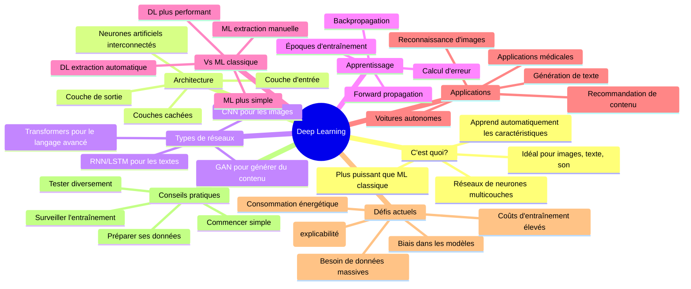

# Synthèse visuelle - Module 1

## Carte heuristique des fondamentaux du Deep Learning

Cette carte résume les concepts essentiels abordés dans le Module 1. Utilisez-la comme référence rapide pour réviser ou comprendre les relations entre les différents concepts.

```mermaid
mindmap
  root((Deep Learning))
    C'est quoi?
      Réseaux de neurones multicouches
      Apprend automatiquement les caractéristiques
      Idéal pour images, texte, son
      Plus puissant que ML classique
    
    Architecture
      Neurones artificiels interconnectés
      Couche d'entrée
      Couches cachées
      Couche de sortie
    
    Types de réseaux
      CNN pour les images
      RNN/LSTM pour les textes
      Transformers pour le langage avancé
      GAN pour générer du contenu
    
    Apprentissage
      Forward propagation
      Calcul d'erreur
      Backpropagation
      Époques d'entraînement
    
    Vs ML classique
      ML extraction manuelle
      DL extraction automatique
      ML plus simple
      DL plus performant
    
    Applications
      Reconnaissance d'images
      Génération de texte
      Recommandation de contenu
      Voitures autonomes
      Applications médicales
    
    Défis actuels
      Besoin de données massives
      Consommation énergétique
      Boîte noire (explicabilité)
      Biais dans les modèles
      Coûts d'entraînement élevés
    
    Conseils pratiques
      Commencer simple
      Préparer ses données
      Surveiller l'entraînement
      Tester diversement
```

!!! info "💡 Astuce"
    Pour explorer plus en détail chaque concept, cliquez sur les différentes branches de la carte mentale interactive ci-dessus.

## Comment utiliser cette carte

1. **Vue d'ensemble**: Commencez par le centre pour comprendre la structure globale
2. **Exploration par thème**: Suivez chaque branche pour approfondir un aspect particulier
3. **Révision ciblée**: Utilisez la carte pour identifier les concepts à réviser davantage

