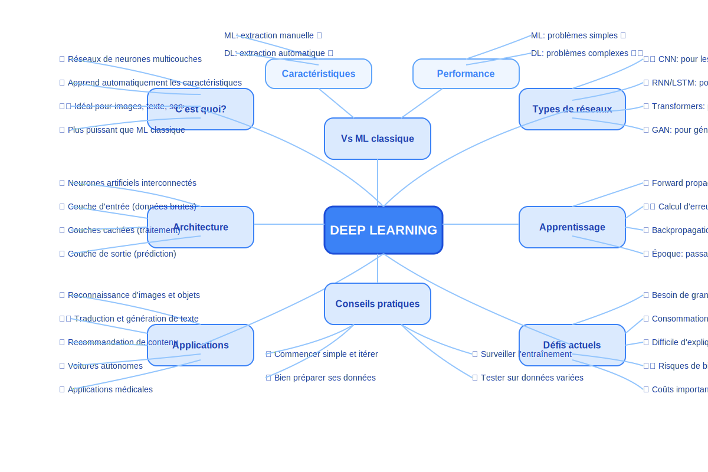

# Synthèse visuelle - Module 1

## Carte heuristique des fondamentaux du Deep Learning

Cette carte résume les concepts essentiels abordés dans le Module 1. Utilisez-la comme référence rapide pour réviser ou comprendre les relations entre les différents concepts.

*Cliquez sur l'image pour l'afficher en plein écran*

## Comment utiliser cette carte

1. **Vue d'ensemble**: Commencez par le centre pour comprendre la structure globale
2. **Exploration par thème**: Suivez chaque branche pour approfondir un aspect particulier
3. **Révision ciblée**: Utilisez la carte pour identifier les concepts à réviser davantage

