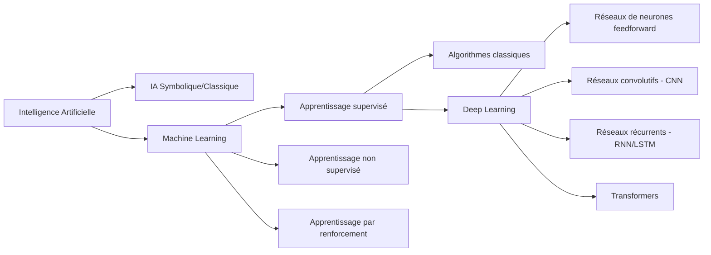
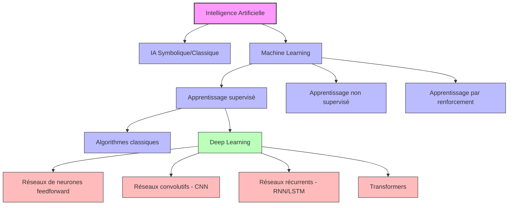
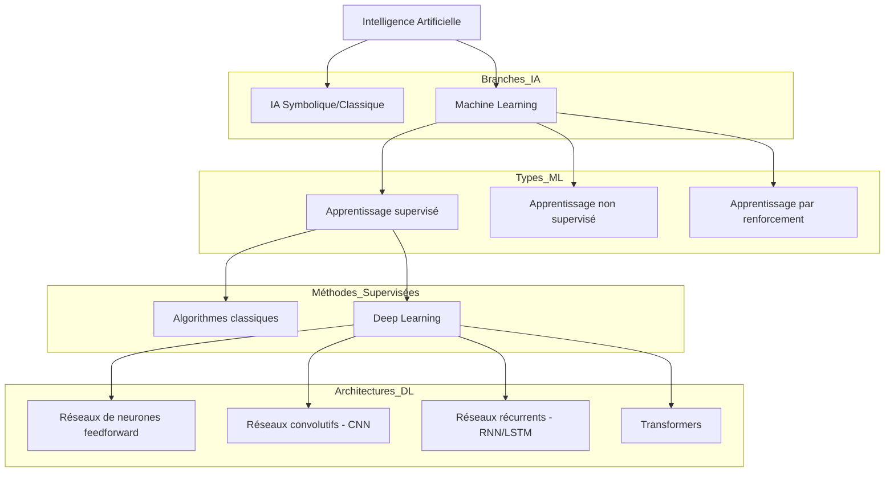
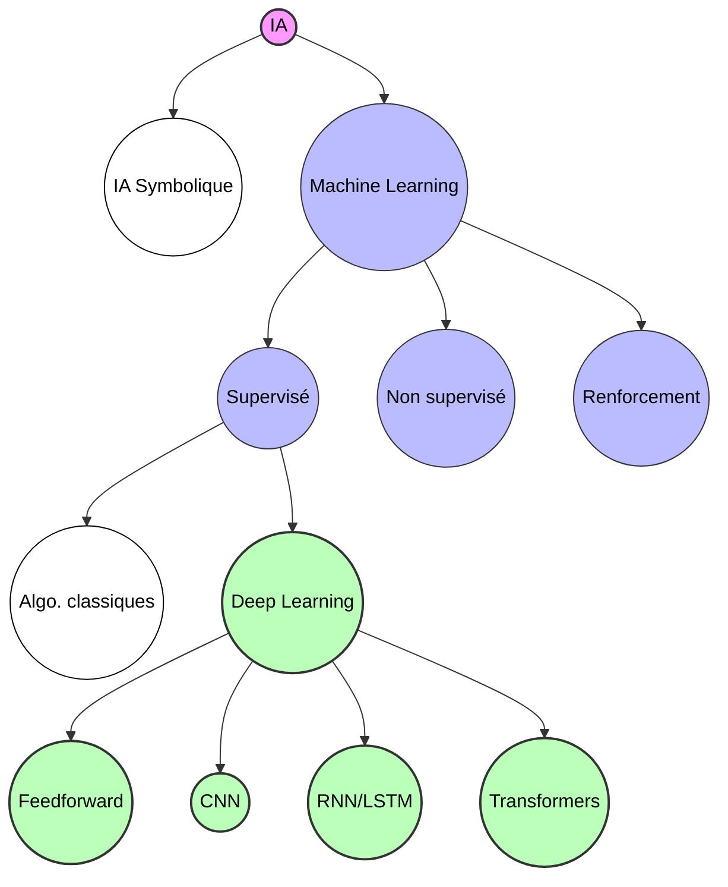
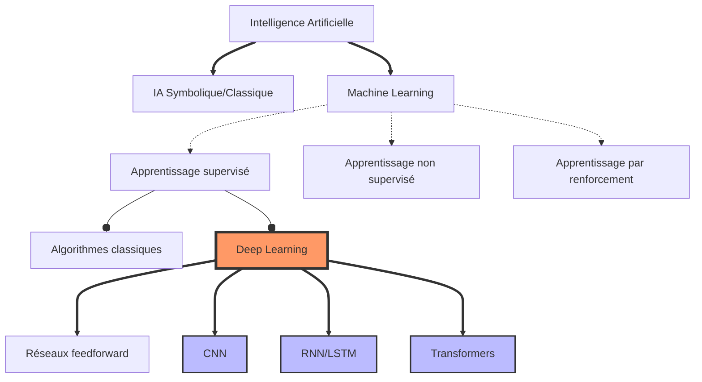
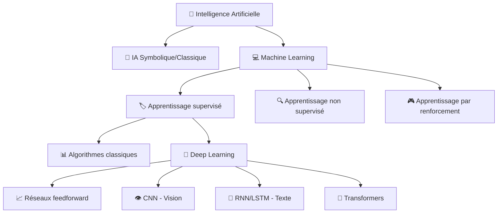
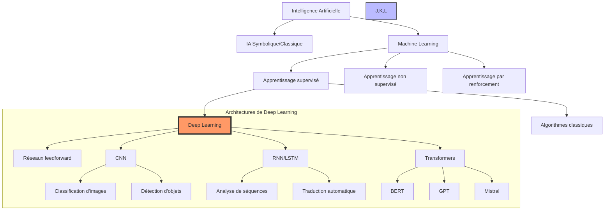
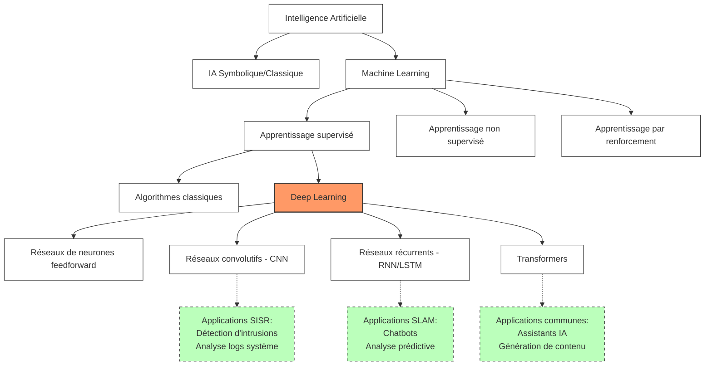
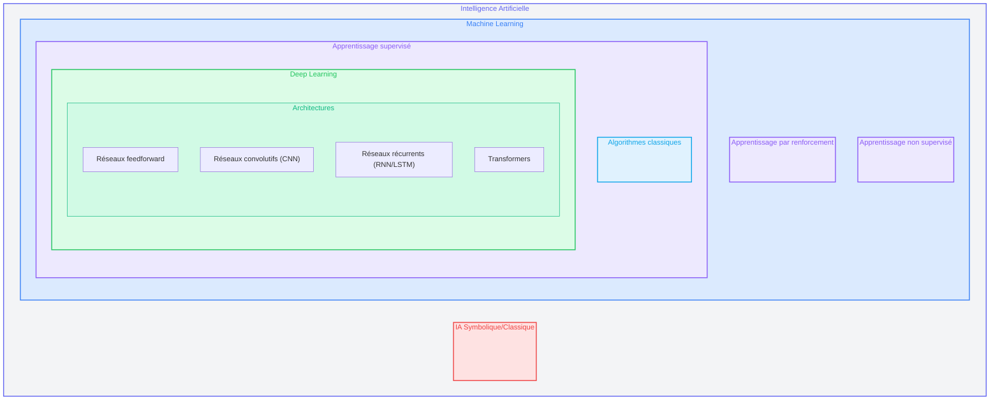

Je vais vous présenter plusieurs alternatives de représentation pour le diagramme hiérarchique du Deep Learning dans l'écosystème de l'IA. Voici différentes approches qui pourraient enrichir visuellement votre cours :

## 1. Représentation en arbre horizontal (LR - Left to Right)

## 2. Représentation avec styles et couleurs

## 3. Représentation avec sous-graphes (groupes)

## 4. Représentation circulaire radiale

## 5. Représentation avec liens stylisés

## 6. Représentation avec icônes

## 7. Représentation complexe avec focus sur le Deep Learning

## 8. Représentation avec focus sur les applications BTS SIO

Chacune de ces représentations offre une perspective différente sur la hiérarchie des concepts en IA et Deep Learning. Vous pouvez choisir celle qui correspond le mieux à votre approche pédagogique ou combiner plusieurs éléments pour créer une visualisation personnalisée.

La représentation avec sous-graphes (#3) est particulièrement utile pour montrer les regroupements logiques, tandis que la représentation avec icônes (#6) peut rendre le schéma plus accessible et mémorable pour les étudiants. La version avec focus sur les applications BTS SIO (#8) fait un lien direct avec le contexte professionnel des étudiants.