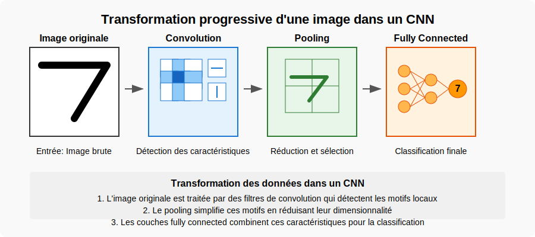

# Phase 1 : Mini-projet CNN pour la vision par ordinateur

## Objectifs de la phase

Dans cette phase, vous allez :

- Comprendre les principes fondamentaux des réseaux de neurones convolutifs (CNN)
- Implémenter un CNN pour la classification d'images avec TensorFlow/Keras
- Visualiser et interpréter les filtres et feature maps d'un CNN
- Intégrer un modèle CNN dans une application web simple

## Partie 1: Principes des CNN (20 min)

### Défi de réflexion initiale

Avant de plonger dans les CNN, prenez 2 minutes pour réfléchir à cette question :

> **Question à méditer** : Comment reconnaissez-vous un visage dans une photo, quelle que soit sa position ou l'éclairage ? Qu'est-ce qui rend cette tâche si facile pour vous et si difficile pour un ordinateur ?

### Activité guidée : Découverte de l'architecture CNN

**Étape 1 : Observation (3 min)**
Examinez ces deux visualisations en parallèle :

- L'image originale d'un chiffre '7' manuscrit et son traitement par les différentes couches d'un CNN

- Les différentes caractéristiques extraites à chaque niveau d'un CNN déjà entraîné

**Étape 2 : Mini-investigation (5 min)**
Formez des binômes et discutez :

- Quels types de détails la première couche semble-t-elle repérer dans l'image?
- Comment ce que "voit" le réseau change-t-il entre la première et la dernière couche?
- Pourquoi est-il utile pour le réseau de transformer l'image à chaque étape?

Les réseaux de neurones convolutifs (CNN) offrent plusieurs avantages, notamment :

- Extraction automatique des caractéristiques

Contrairement aux méthodes traditionnelles de vision par ordinateur qui nécessitent une extraction manuelle des caractéristiques, les CNN apprennent automatiquement les motifs pertinents (bords, textures, formes) à partir des données.

- Partage des poids et réduction du nombre de paramètres 

Grâce aux filtres de convolution partagés sur toute l'image, les CNN réduisent considérablement le nombre de paramètres à entraîner, ce qui diminue les besoins en mémoire et en calcul par rapport aux réseaux de neurones entièrement connectés.

- Invariance aux translations et robustesse aux variations

Les couches de convolution et de pooling permettent aux CNN d'être robustes aux décalages, rotations et déformations dans les images, ce qui améliore leur capacité à reconnaître des objets dans différentes conditions.

**Étape 3 : Construction du modèle mental (5 min)**
Sur votre feuille de travail, complétez le schéma simplifié d'un CNN :

1. Identifiez et nommez les trois types principaux de couches
2. Pour chaque type, précisez brièvement sa fonction
3. Listez les trois avantages majeurs des CNN

**Étape 4 : Analogie concrète (3 min)**
Pour comprendre le fonctionnement d'un CNN, voyons comment il pourrait identifier un personnage célèbre comme Dark Vador :

- **La couche de convolution** repère les caractéristiques distinctives : "Je détecte un casque noir, un respirateur, une cape..."
- **La couche de pooling** ignore les détails non pertinents : "Peu importe l'angle de vue, l'éclairage, s'il est de face ou de profil..."
- **La couche fully connected** prend la décision finale : "D'après toutes ces caractéristiques combinées, c'est Dark Vador à 99.8%!"

Cette analogie montre comment un CNN analyse une image de manière hiérarchique, comme notre cerveau le fait naturellement.

### Points importants à retenir

> **À savoir avant de passer à la pratique :**
> 
> 1. Les CNN sont conçus spécifiquement pour traiter les données en grille comme les images.
>
> 2. Les filtres de convolution agissent comme des détecteurs de motifs qui s'appliquent à toute l'image.
>
> 3. Le pooling permet de réduire les dimensions tout en conservant l'information importante.
>
> 4. Les poids du réseau sont ajustés automatiquement pendant l'entraînement.
>
> 5. Un CNN profond permet de détecter des motifs de plus en plus complexes et abstraits.
>
> 6. Le grand avantage des CNN est qu'ils apprennent automatiquement les caractéristiques pertinentes, sans qu'on ait à les programmer manuellement.

### Transition vers l'implémentation

Maintenant que vous avez conceptualisé l'architecture d'un CNN, passons à l'implémentation pratique pour voir ces concepts en action. Gardez votre schéma à portée de main - vous pourrez le compléter avec des observations pratiques.

## Partie 2: Implémentation d'un CNN pour MNIST (40 min)

### Instructions

1. Ouvrez le notebook Jupyter [cnn-classification](ressources/cnn-classification.md) dans Google Colab
2. Suivez les instructions étape par étape pour implémenter un CNN pour la classification des chiffres manuscrits (MNIST)
3. Exécutez chaque cellule et observez les résultats
4. Portez une attention particulière aux sections suivantes :
   
   - Architecture du modèle CNN
   - Processus d'entraînement
   - Visualisation des filtres et feature maps
   - Analyse des performances et des erreurs

### Points clés à explorer

- Comment les couches de convolution extraient-elles des caractéristiques de plus en plus abstraites ?
- Quel est l'impact du nombre de filtres et de couches sur les performances ?
- Comment les feature maps révèlent-elles ce que "voit" le réseau ?
- Quelles sont les limites du modèle face à des données bruitées ou déformées ?

## Partie 3: Intégration dans une application web (30 min)

Dans cette partie, vous allez découvrir comment intégrer un modèle CNN pré-entraîné dans une application web interactive.

# Mini-projet : Reconnaissance de chiffres manuscrits 

## Contexte professionnel

Vous êtes stagiaire dans une PME où les employés doivent régulièrement saisir manuellement des codes à partir de documents papier (bons de commande, formulaires clients, etc.). Votre responsable informatique souhaite explorer des solutions d'automatisation et vous demande de tester une application de reconnaissance de chiffres manuscrits.

### Étape 1: Préparation de l'environnement (8 minutes)

Pour la partie web, vous aurez besoin d'un fichier `mnist_cnn_model.h5` contenant votre modèle CNN entraîné. Ce fichier doit être généré sur Google Colab en suivant ces étapes:

### Génération du modèle sur Google Colab

1. Coller dans un nouveau notebook Google Colab le code du fichier suivant :[`create_model.py`](ressources/create_model.py).

3. Exécutez la cellule en cliquant sur le bouton de lecture ▶️ à gauche de la cellule, ou en appuyant sur Shift+Enter

## Attendre l'entraînement et télécharger le modèle

1. L'exécution durera environ 3-5 minutes sur Google Colab (qui utilise des GPU/TPU)
2. Vous verrez la progression de l'entraînement pour chaque époque
3. À la fin, votre navigateur démarrera automatiquement le téléchargement du fichier `mnist_cnn_model.h5`
4. Enregistrez ce fichier dans le dossier de votre projet web

## Avantages de cette approche:
- Aucune installation locale requise
- Utilisation gratuite des ressources GPU de Google
- Exécution plus rapide que sur un ordinateur standard
- Interface familière et intuitive
- Pas de problème d'installation ou de performance de TensorFlow sur sa machine locale.

### Étape 2 : Configuration (5 minutes)

1.**Préparation de l'environnement VS Code**
   
   - Ouvrez Visual Studio Code
   - Créez un nouveau dossier pour le projet: `File > Open Folder` et créez un dossier nommé `reconnaissance-chiffres`
   - Dans VS Code, créez la structure de dossiers suivante via l'explorateur:
     - Créez un dossier `templates`
     - Créez un dossier `static`
     - Dans `static`, créez les sous-dossiers `css` et `js`Problpro

2.📥**Téléchargement des fichiers de l'application web**

Téléchargez les fichiers suivants et placez-les dans les dossiers indiqués :

- **[code-app-web.zip](../module2/ressources/code-app-web.zip)** 

📌 *Clic droit sur le lien → "Enregistrer le lien sous..."* pour télécharger chaque fichier.

1.  **Structure des dossiers** :

   *Assurez-vous que votre structure de dossiers est la suivante: