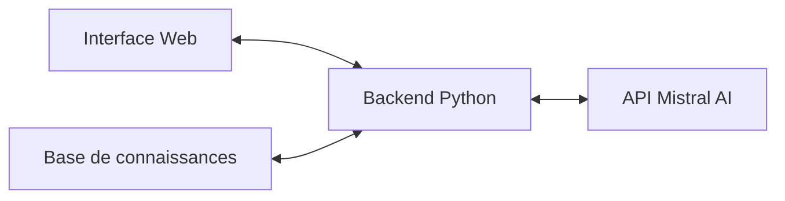

# 📋 Phase 3: Préparation au projet final (60 min)


## 🎯 Objectifs de la phase

Dans cette phase, vous allez :

- Comprendre en détail le cahier des charges du projet final (chatbot pédagogique)
- Étudier des cas réels d'entreprises utilisant des chatbots similaires
- Explorer l'API Mistral AI pour le traitement du langage naturel
- Vous familiariser avec les frameworks web nécessaires au projet
- Préparer les bases techniques et fonctionnelles pour votre projet de chatbot

## 📝 Présentation du cahier des charges du chatbot pédagogique (15 min)

**🎯 Objectif**: Comprendre les spécifications détaillées du projet final et les critères d'évaluation.

### 🔍 Vision du projet

Le projet final consiste à développer un chatbot pédagogique capable d'expliquer les concepts du Deep Learning, de répondre aux questions techniques et d'accompagner les apprenants dans leur découverte de ce domaine.

> 🎯 **Objectif principal** : Concevoir un chatbot interactif qui aide les étudiants de BTS SIO à comprendre les concepts du Deep Learning à travers des explications personnalisées, des exemples concrets et des exercices adaptés.

!!! info "Caractéristiques essentielles"
    Le chatbot devra être capable de :
    
    - S'adapter au niveau de l'utilisateur (débutant, intermédiaire, avancé)
    - Fournir des explications claires et progressives
    - Proposer des exemples concrets et pertinents
    - Répondre aux questions spécifiques sur le Deep Learning

### Architecture technique

Le chatbot s'appuiera sur une architecture moderne composée de trois éléments principaux :



#### 1. Interface conversationnelle

- Interface web simple et intuitive
- Affichage des messages en format discussion
- Indicateur de chargement pendant le traitement
- Historique de conversation

#### 2. Backend Flask/FastAPI

- Gestion des requêtes et des sessions
- Enrichissement des prompts avec la base de connaissances
- Communication avec l'API Mistral
- Logique de traitement des réponses

#### 3. Intégration API Mistral AI

- Configuration et paramètrage des requêtes
- Gestion du contexte de conversation
- Optimisation des prompts
- Gestion des erreurs et limitations

#### 4. Base de connaissances

- Structure JSON organisée par concepts
- Exercices et quiz par thématique

### Fonctionnalités clés

Le chatbot pédagogique offrira les fonctionnalités suivantes :

1. **Explication des concepts**
   
    - Définition adaptée au niveau de l'utilisateur
    - Exemples concrets pour illustrer chaque notion
    - Analogies et comparaisons pour faciliter la compréhension

2. **Réponse aux questions**
   
    - Compréhension des questions techniques
    - Réponses précises basées sur la base de connaissances
    - Capacité à demander des clarifications si nécessaire

3. **Progression adaptative**
   
    - Détection du niveau de l'utilisateur
    - Suggestions de concepts à explorer ensuite
    - Augmentation progressive de la complexité

4. **Exercices interactifs**
   
    - Génération de quiz sur les concepts vus
    - Problèmes simples à résoudre
    - Feedback sur les réponses

### Critères d'évaluation

Votre chatbot pédagogique sera évalué selon les critères suivants :

| Critère | Pondération | Description |
|---------|-------------|-------------|
| Fonctionnalité | 30% | Interface utilisable, réponses cohérentes, absence de bugs |
| Qualité pédagogique | 25% | Pertinence des explications, adaptation au niveau, exemples appropriés |
| Intégration technique | 20% | Utilisation efficace de l'API, gestion du contexte, optimisation |
| Base de connaissances | 15% | Structure, couverture des concepts, précision technique |
| Documentation | 10% | Guide utilisateur, documentation technique, commentaires code |

!!! warning "Point d'attention"
    La qualité pédagogique est un critère essentiel. Veillez à ce que votre chatbot ne se contente pas de fournir des informations techniques, mais qu'il les explique de manière accessible et progressive.

### Livrables attendus

1. **Code source complet** du chatbot pédagogique
2. **Base de connaissances structurée** sur le Deep Learning
3. **Documentation technique** expliquant l'architecture et les choix d'implémentation
4. **Guide utilisateur** pour la prise en main
5. **Présentation** de 5 minutes du projet finalisé

## 🔍 Étude de cas d'entreprises utilisant des chatbots (10 min)

Avant de commencer le développement, examinons quelques exemples concrets d'entreprises qui ont mis en place des chatbots similaires à celui que vous allez développer.

### Cas 1: Chatbot pédagogique pour une école de programmation

**Entreprise**: CodeSchool (30 formateurs, 500+ étudiants)

**Problématique**: 
Les formateurs recevaient de nombreuses questions basiques identiques, ce qui limitait leur disponibilité pour des problèmes plus complexes.

**Solution**: 
Développement d'un chatbot assistant basé sur une API de LLM, avec une base de connaissances construite à partir du matériel de cours.

**Architecture**:

- Frontend: Interface web intégrée à la plateforme d'apprentissage
- Backend: API Flask avec mise en cache Redis
- LLM: OpenAI API avec fine-tuning spécifique aux cours
- Base de connaissances: Structurée en JSON par modules de cours

**Résultats**:

- Réduction de 40% des questions basiques aux formateurs
- Satisfaction des étudiants à 85% concernant les réponses du chatbot
- ROI positif après 4 mois d'utilisation
- Création de 15 nouveaux modules de cours grâce au temps libéré

**Leçons apprises**:

- Importance d'un système de feedback immédiat sur les réponses
- Nécessité de maintenir la base de connaissances à jour
- Valeur des réponses comportant des exemples de code fonctionnels

### Cas 2: Assistant virtuel pour la formation interne

**Entreprise**: TechConsult (cabinet de conseil IT, 120 employés)

**Problématique**: 
Difficulté à former rapidement les nouveaux consultants sur les technologies spécifiques utilisées par l'entreprise.

**Solution**:
Chatbot de formation accessible 24/7, intégré à l'intranet, avec connaissance des processus et technologies internes.

**Architecture**:

- Interface: Application web responsive
- Backend: NodeJS avec FastAPI
- LLM: Combinaison d'API locale et Mistral AI
- Base de connaissances: Documents techniques convertis en embeddings vectoriels

**Résultats**:

- Réduction du temps d'onboarding de 3 semaines à 10 jours
- Augmentation de 25% du taux de réussite aux certifications internes
- Économie estimée de 180 heures de formation par an
- Adoption à 92% parmi les nouveaux employés

**Leçons apprises**:

- L'importance d'utiliser le vocabulaire spécifique de l'entreprise
- La valeur d'un historique de conversation persistant
- L'utilité des prompts techniques bien formulés

!!! tip "Application à votre projet"
    Ces études de cas montrent que les chatbots pédagogiques peuvent apporter une valeur significative lorsqu'ils sont bien conçus. Pour votre projet, concentrez-vous particulièrement sur la structure de la base de connaissances et sur la qualité des prompts envoyés à l'API Mistral AI.

## 🧪 Exploration guidée de l'API Mistral AI (20 min)

Maintenant, explorons l'API Mistral AI que vous utiliserez pour développer votre chatbot pédagogique.

### Préparation avant la séance

Pour optimiser le temps de développement lors de la séance du Module 4, veuillez effectuer les étapes suivantes **avant la séance** :

### Création d'un compte et clé API

1. Rendez-vous sur [console.mistral.ai](https://console.mistral.ai/)
2. Créez un compte (gratuit)
3. Une fois connecté, cliquez sur "API Keys" dans le menu
4. Cliquez sur "Create API Key", donnez-lui un nom (ex: "Projet Chatbot BTS")
5. **Important**: Copiez et sauvegardez la clé générée, elle ne sera plus affichée ensuite

!!! warning "Sécurité de la clé API"
    Ne partagez jamais votre clé API et ne la stockez pas directement dans votre code source. Utilisez des variables d'environnement ou un fichier .env non versionné.

### Tester avec l'API

Commençons par un exemple simple pour tester l'API:

```python
import os
from mistralai.client import MistralClient
from mistralai.models.chat_completion import ChatMessage

# Configuration de l'API
api_key = "votre_clé_api_ici"  # Remplacez par votre clé
client = MistralClient(api_key=api_key)

# Messages
messages = [
    ChatMessage(role="system", content="Tu es un assistant pédagogique spécialisé dans l'explication du Deep Learning pour des étudiants de BTS SIO."),
    ChatMessage(role="user", content="Peux-tu m'expliquer simplement ce qu'est un réseau de neurones convolutif?")
]

# Appel à l'API
chat_response = client.chat(
    model="mistral-tiny",  # Modèle le plus léger
    messages=messages,
)

# Affichage de la réponse
print(chat_response.choices[0].message.content)
```

### Structure de l'API Mistral

L'API Mistral AI fonctionne avec une structure simple :

1. **Messages** : Liste de messages représentant une conversation, chacun avec un rôle (system, user, assistant)
2. **Modèle** : Choix du modèle Mistral à utiliser (mistral-tiny, mistral-small, mistral-medium...)
3. **Paramètres** : Configuration du comportement (température, nombre max de tokens, etc.)

### Gestion du contexte conversationnel

Pour maintenir un contexte de conversation, il suffit d'ajouter les messages précédents à chaque requête :

```python
# Fonction pour gérer une conversation
def chat_with_context(messages, user_input):
    # Ajouter le message de l'utilisateur
    messages.append(ChatMessage(role="user", content=user_input))
    
    # Appel à l'API
    response = client.chat(
        model="mistral-tiny",
        messages=messages,
    )
    
    # Récupérer la réponse
    assistant_message = response.choices[0].message.content
    
    # Ajouter la réponse au contexte
    messages.append(ChatMessage(role="assistant", content=assistant_message))
    
    return assistant_message, messages

# Initialiser la conversation
conversation = [
    ChatMessage(role="system", content="Tu es un assistant pédagogique spécialisé dans l'explication du Deep Learning pour des étudiants de BTS SIO.")
]

# Premier échange
response, conversation = chat_with_context(conversation, "Qu'est-ce qu'un réseau de neurones?")
print("Assistant:", response)

# Deuxième échange (avec le contexte précédent)
response, conversation = chat_with_context(conversation, "Comment fonctionne l'apprentissage?")
print("Assistant:", response)
```

### Optimisation des prompts

La qualité des réponses dépend beaucoup de la façon dont vous formulez vos instructions (prompts). Voici quelques conseils pour les optimiser :

#### 1. Instructions système claires et détaillées

```python
system_prompt = """
Tu es un assistant pédagogique spécialisé dans le Deep Learning pour des étudiants de BTS SIO. 
Quand tu réponds:
1. Utilise un langage simple et accessible
2. Fournis toujours un exemple concret
3. Structure tes explications en plusieurs points
4. Si tu n'es pas sûr d'une information, indique-le clairement
5. Adapte le niveau technique au profil de l'étudiant (débutant, intermédiaire, avancé)
"""
```

#### 2. Enrichissement avec la base de connaissances

```python
def enrich_prompt_with_knowledge(user_query, knowledge_base, user_level="débutant"):
    # Rechercher des informations pertinentes dans la base de connaissances
    relevant_info = search_knowledge_base(user_query, knowledge_base)
    
    # Enrichir le prompt avec ces informations
    enriched_prompt = f"""
Question de l'utilisateur: {user_query}

Informations pertinentes (niveau: {user_level}):
{relevant_info}

Réponds de manière pédagogique en utilisant ces informations et en adaptant ton explication au niveau {user_level}.
"""
    return enriched_prompt
```

#### 3. Paramétrage adapté

```python
# Pour des explications techniques (plus précises, moins créatives)
technical_params = {
    "temperature": 0.3,  # Faible température pour des réponses plus déterministes
    "max_tokens": 500    # Limite de longueur raisonnable
}

# Pour des exemples et analogies (plus créatifs)
creative_params = {
    "temperature": 0.7,  # Température plus élevée pour plus de créativité
    "max_tokens": 300    # Limite de longueur adaptée
}

# Fonction de choix de paramètres selon le contexte
def get_params_for_query(query):
    if "explique" in query.lower() or "définition" in query.lower():
        return technical_params
    elif "exemple" in query.lower() or "analogie" in query.lower():
        return creative_params
    else:
        return {"temperature": 0.5, "max_tokens": 400}  # Paramètres par défaut
```

!!! tip "Conseil pour le projet"
    La qualité du prompt est cruciale pour obtenir des réponses pédagogiquement pertinentes. Prenez le temps d'expérimenter différentes formulations et structures pour trouver celle qui fonctionne le mieux.

### Gestion des erreurs et limites

Il est important de gérer correctement les erreurs potentielles lors de l'utilisation de l'API :

```python
def safe_api_call(messages, max_retries=3):
    retries = 0
    while retries < max_retries:
        try:
            response = client.chat(
                model="mistral-tiny",
                messages=messages,
                timeout=10  # Timeout en secondes
            )
            return response
        except Exception as e:
            retries += 1
            print(f"Erreur API (tentative {retries}/{max_retries}): {e}")
            if retries >= max_retries:
                # Réponse de secours si l'API échoue
                return {
                    "choices": [{
                        "message": {
                            "content": "Désolé, je rencontre des difficultés techniques. Veuillez réessayer dans quelques instants."
                        }
                    }]
                }
            # Attente avant nouvelle tentative
            time.sleep(2)
```

## 📝 Introduction aux frameworks web pour le projet (15 min)

### Qu'est-ce qu'un framework web ?

!!! warning "Nouvelle compétence"
    Les frameworks web comme Flask ou FastAPI ne sont pas supposés connus à ce stade. Cette section vous présente les bases essentielles pour le projet.

Un framework web est une bibliothèque qui facilite le développement d'applications web en fournissant des structures et fonctionnalités standardisées. Pour notre projet de chatbot, nous avons besoin d'un framework léger qui permettra de :

- Créer une API pour communiquer avec l'interface utilisateur
- Gérer les requêtes HTTP
- Intégrer facilement l'API Mistral
- Servir du contenu statique (HTML, CSS, JavaScript)

### Deux options principales : Flask vs FastAPI

#### Flask : Simple et rapide à apprendre

Flask est un micro-framework web minimaliste pour Python, parfait pour les débutants :

```python
# Exemple minimal d'application Flask
from flask import Flask, request, jsonify, render_template

app = Flask(__name__)

@app.route('/')
def home():
    return render_template('index.html')

@app.route('/chat', methods=['POST'])
def chat():
    user_message = request.json.get('message', '')
    # Traitement avec l'API Mistral (à implémenter)
    response = "Ceci est une réponse temporaire"
    return jsonify({"response": response})

if __name__ == '__main__':
    app.run(debug=True)
```

**Avantages de Flask :**
- Très simple à comprendre et à mettre en œuvre
- Excellente documentation et large communauté
- Flexible et extensible
- Suffisant pour notre projet de chatbot

#### FastAPI : Plus moderne, plus rapide

FastAPI est un framework plus récent qui offre de meilleures performances et une documentation automatique :

```python
# Exemple minimal d'application FastAPI
from fastapi import FastAPI, Request
from fastapi.responses import HTMLResponse
from fastapi.staticfiles import StaticFiles
from fastapi.templating import Jinja2Templates
from pydantic import BaseModel

app = FastAPI()
templates = Jinja2Templates(directory="templates")
app.mount("/static", StaticFiles(directory="static"), name="static")

class ChatMessage(BaseModel):
    message: str

@app.get("/", response_class=HTMLResponse)
async def home(request: Request):
    return templates.TemplateResponse("index.html", {"request": request})

@app.post("/chat")
async def chat(chat_message: ChatMessage):
    # Traitement avec l'API Mistral (à implémenter)
    response = "Ceci est une réponse temporaire"
    return {"response": response}
```

**Avantages de FastAPI :**
- Plus performant (traitement asynchrone)
- Documentation automatique (OpenAPI)
- Validation de données intégrée
- Développement plus moderne

### Structure recommandée pour le projet

Quelle que soit votre choix de framework, nous vous recommandons la structure de projet suivante :

```
chatbot-pedagogique/
├── app.py                   # Point d'entrée de l'application
├── config.py                # Configuration (clés API, paramètres)
├── templates/               # Templates HTML
│   └── index.html           # Interface web
├── static/                  # Fichiers statiques (CSS, JS)
│   ├── css/                 # Styles CSS
│   ├── js/                  # Scripts JavaScript
│   └── img/                 # Images
├── services/                # Services métier
│   ├── mistral_service.py   # Intégration API Mistral
│   └── knowledge_service.py # Gestion base de connaissances
└── knowledge_base/          # Base de connaissances
    └── concepts.json        # Structure des concepts DL
```

### Ressources pour débuter rapidement

Pour vous aider à prendre en main ces frameworks, voici quelques ressources :

- **Flask**: 
  - [Documentation officielle Flask](https://flask.palletsprojects.com/)
  - [Tutoriel Flask pour débutants](https://flask.palletsprojects.com/en/2.3.x/tutorial/)
  - Pour notre projet, le [Guide Flask pour API REST](https://flask.palletsprojects.com/en/2.3.x/tutorial/views/) est particulièrement pertinent

- **FastAPI**:
  - [Documentation officielle FastAPI](https://fastapi.tiangolo.com/)
  - [Tutoriel FastAPI pour débutants](https://fastapi.tiangolo.com/tutorial/)
  - La section sur les [WebSockets](https://fastapi.tiangolo.com/advanced/websockets/) pourrait être utile pour une version avancée du chatbot

### Template de démarrage fourni

Pour faciliter votre travail, un template de projet basé sur Flask sera fourni au début du Module 4. Ce template inclura :

- Structure de base du projet
- Interface HTML/CSS/JS simple pour le chatbot
- Code d'intégration minimal pour l'API Mistral
- Exemple de base de connaissances minimale

Cela vous permettra de vous concentrer sur les aspects pédagogiques et IA du projet plutôt que sur la mise en place technique de l'infrastructure web.

!!! tip "Conseil pour le projet"
    Pour la majorité des étudiants, **Flask** est recommandé pour sa simplicité. Choisissez **FastAPI** uniquement si vous avez déjà une bonne expérience en développement web ou si vous souhaitez explorer un framework plus moderne.

## 📝 Préparation au développement (5 min)

Pour préparer efficacement votre projet de chatbot pédagogique, voici les premières étapes à suivre :

1. **Planification**
   
     - **Séance 4, Phase 1** (2h30): Développement du chatbot
     - **Séance 4, Phase 2** (1h): Finalisation et tests
     - **Séance 4, Phase 3** (30min): Présentation des projets

!!! info "Ressources complémentaires"
    Pour vous aider dans le développement de votre chatbot, consultez ces ressources:
    
    - [Documentation complète de l'API Mistral](../ressources/api-mistral.md)
    - [Schémas JSON pour la base de connaissances](../ressources/json-schemas.md)
    - [Templates de code pour le frontend et backend](../ressources/templates-code-chatbot.md)

## 📝 Conclusion et document de conception

Cette phase vous a permis de comprendre le cahier des charges détaillé de votre projet de chatbot pédagogique, d'explorer les possibilités de l'API Mistral AI, et de vous préparer au développement.

Lors de la prochaine séance, vous passerez à l'implémentation concrète de votre chatbot. D'ici là, nous vous recommandons de:
- Vous familiariser davantage avec l'API Mistral AI
- Réfléchir à la structure de votre base de connaissances
- Explorer des exemples de chatbots éducatifs existants

N'oubliez pas de compléter le [Document de conception - Chatbot pédagogique](ressources/document-conception-chatbot.md) pour documenter vos choix d'architecture, la structure de votre base de connaissances et les fonctionnalités que vous souhaitez implémenter.

!!! success "Compétences développées"
    À travers cette phase de préparation, vous avez développé plusieurs compétences clés du référentiel BTS SIO :
    
    - **B1.3** : Analyse des besoins pour une application web interactive
    - **B2.2** : Conception d'une architecture pour une application d'IA
    - **B2.3** : Planification du développement d'une solution technique

[Retour au Module 3](index.md){ .md-button }
[Continuer vers le Module 4](../module4/index.md){ .md-button .md-button--primary }