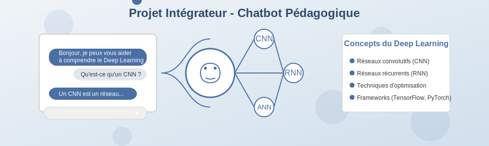
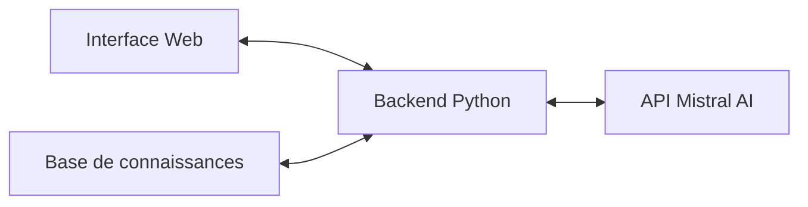

# Module 4 : Projet intégrateur - Chatbot pédagogique

## Objectifs du module

Cette dernière séance vous permettra de :

- Appliquer l'ensemble des connaissances acquises dans un projet concret et complet
- Développer un chatbot pédagogique fonctionnel expliquant le Deep Learning
- Intégrer l'API Mistral AI dans une solution complète
- Présenter et défendre votre solution technique

## Vision du projet

Le projet consiste à développer un assistant virtuel conversationnel capable d'expliquer les concepts du Deep Learning, de répondre aux questions techniques et d'accompagner les apprenants dans leur découverte de ce domaine.

> 🎯 **Objectif** : Concevoir un chatbot interactif qui aide les étudiants de BTS SIO à comprendre les concepts du Deep Learning à travers des explications personnalisées, des exemples concrets et des exercices adaptés.

## Architecture technique

Le chatbot s'appuiera sur une architecture moderne composée de trois éléments principaux :

### 1. Interface conversationnelle
- Interface web simple et intuitive
- Affichage des messages en format discussion
- Indicateur de chargement pendant le traitement
- Historique de conversation

### 2. Backend Flask/FastAPI
 - Gestion des requêtes et des sessions
 - Enrichissement des prompts avec la base de connaissances
 - Communication avec l'API Mistral
 - Logique de traitement des réponses

### 3. Intégration API Mistral AI
 - Configuration et paramètrage des requêtes
 - Gestion du contexte de conversation
 - Optimisation des prompts
 - Gestion des erreurs et limitations

### 4. Base de connaissances
 - Structure JSON organisée par concepts
 - Exercices et quiz par thématique

## Fonctionnalités clés

Le chatbot pédagogique offrira les fonctionnalités suivantes :

1. **Explication des concepts**
    - Définition adaptée au niveau de l'utilisateur
    - Exemples concrets pour illustrer chaque notion
    - Analogies et comparaisons pour faciliter la compréhension

2. **Réponse aux questions**
    - Compréhension des questions techniques
    - Réponses précises basées sur la base de connaissances
    - Capacité à demander des clarifications si nécessaire

3. **Progression adaptative**
    - Détection du niveau de l'utilisateur
    - Suggestions de concepts à explorer ensuite
    - Augmentation progressive de la complexité

4. **Exercices interactifs**
    - Génération de quiz sur les concepts vus
    - Problèmes simples à résoudre
    - Feedback sur les réponses

## Approche pédagogique

Cette séance est entièrement basée sur la réalisation d'un projet concret en équipe. Vous devrez mobiliser toutes les compétences développées lors des séances précédentes pour créer une application complète et fonctionnelle. L'accent est mis sur l'autonomie, la collaboration et la mise en pratique professionnelle.

## Structure de la séance (4h)

```mermaid
gantt
    title Planning de la séance
    dateFormat  HH:mm
    axisFormat %H:%M
    
    section Phase 1
    Développement du chatbot           :2h30, 00:00, 02:30
    
    section Phase 2
    Finalisation et tests              :1h, 02:30, 03:30
    
    section Phase 3
    Présentation des projets           :30min, 03:30, 04:00  
```

## Trois phases de réalisation

### [Phase 1 : Développement du chatbot](partie1-developpement.md) (2h30)

Implémentez les fonctionnalités principales de votre chatbot pédagogique :

- Mise en place de l'interface conversationnelle
- Intégration avancée avec l'API Mistral AI
- Structuration et enrichissement de la base de connaissances
- Développement des fonctionnalités d'aide à l'apprentissage

### [Phase 2 : Finalisation et tests](partie2-finalisation.md) (1h)

Peaufinez votre solution et assurez-vous de sa qualité :

- Tests fonctionnels et scénarios d'utilisation
- Optimisation des performances
- Documentation technique et guide utilisateur
- Préparation de la démonstration

### [Phase 3 : Présentation des projets](partie3-presentation.md) (30min)

Présentez votre solution à la classe :

- Démonstration en direct du chatbot
- Explication des choix techniques
- Retour sur les défis rencontrés et les solutions adoptées
- Questions-réponses

## Défis techniques

Les principaux défis à relever seront :

1. **Prompt engineering efficace**
   - Formuler des instructions claires pour l'API Mistral
   - Maintenir la cohérence pédagogique dans les réponses
   - Éviter les hallucinations du modèle

2. **Intégration technique**
   - Communication fluide entre frontend et backend
   - Gestion asynchrone des requêtes API
   - Optimisation des temps de réponse

3. **Qualité pédagogique**
   - Structure cohérente de la base de connaissances
   - Adaptation au niveau de l'utilisateur
   - Progression logique entre les concepts

## Ressources nécessaires

Pour cette séance, vous aurez besoin de :

- Votre document de conception préparé lors de la séance 3
- Compte et clé API Mistral AI
- Environnement de développement (Google Colab ou local)
- Templates fournis pour la documentation

Ressources fournies :
- Documentation complète de l'API Mistral
- Structure JSON pour la base de connaissances
- Templates de code pour l'interface et le backend
- Exemples de prompts efficaces

## Livrables attendus

À l'issue de cette séance, vous devrez remettre :

1. **Code source complet** du chatbot pédagogique
2. **Base de connaissances structurée** sur le Deep Learning
3. **Documentation technique** expliquant l'architecture et les choix d'implémentation
4. **Guide utilisateur** pour la prise en main
5. **Présentation** avec support à fournir

Ces livrables constituent l'aboutissement de votre parcours et seront évalués selon les critères détaillés dans la [grille d'évaluation](../evaluation/criteres-evaluation-seance4.md).

## Prêt à relever le défi ?

C'est l'heure de mettre en pratique tout ce que vous avez appris pour créer un outil réellement utile. Bonne chance !

[Commencer la Phase 1](partie1-developpement.md){ .md-button .md-button--primary }
[Évaluer vos connaissances](qcm-evaluation-module4.md){ .md-button .md-button--secondary }

