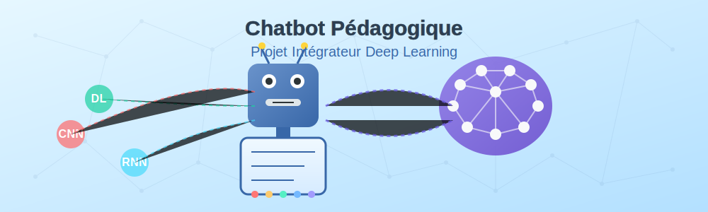

# Projet Chatbot Pédagogique sur le Deep Learning



## Introduction au projet

Le projet de chatbot pédagogique représente l'aboutissement de votre parcours dans la formation sur le Deep Learning. Il vous permet de mettre en pratique l'ensemble des connaissances et compétences acquises tout en créant un outil concret et utile.

Ce document présente en détail la vision, les objectifs et les spécifications du projet.

## Vision du projet

### Qu'est-ce qu'un chatbot pédagogique ?

Un chatbot pédagogique est un assistant virtuel conçu spécifiquement pour accompagner l'apprentissage. Contrairement aux chatbots commerciaux ou de service client, son objectif principal est de faciliter la compréhension de concepts complexes en s'adaptant au niveau et aux besoins de l'apprenant.

### Pourquoi un chatbot sur le Deep Learning ?

Le Deep Learning est un domaine technique complexe qui combine mathématiques, informatique et domaines d'application variés. Pour les étudiants de BTS SIO, cette complexité peut représenter un obstacle à l'apprentissage. Un assistant conversationnel permet de :

- Rendre les concepts abstraits plus accessibles grâce à des explications personnalisées
- Proposer des exemples concrets adaptés au niveau de compréhension de l'étudiant
- Offrir une disponibilité permanente pour répondre aux questions
- Favoriser un apprentissage à rythme personnalisé

## Objectifs pédagogiques

Votre chatbot doit permettre aux utilisateurs de :

1. **Comprendre les concepts fondamentaux** du Deep Learning de manière progressive
2. **Explorer les différentes architectures** de réseaux de neurones (CNN, RNN, etc.)
3. **Visualiser mentalement** le fonctionnement des algorithmes grâce à des analogies et des exemples
4. **Tester leurs connaissances** à travers des quiz et exercices interactifs
5. **Approfondir** certaines notions selon leurs besoins et intérêts

## Public cible

Le chatbot s'adresse principalement aux :

- **Étudiants de BTS SIO** découvrant le Deep Learning
- **Développeurs débutants** souhaitant intégrer des fonctionnalités d'IA dans leurs projets
- **Professionnels en reconversion** vers les métiers de l'intelligence artificielle

## Spécifications fonctionnelles

Pour la séance de 4h, nous allons nous concentrer sur le développement d'un **prototype fonctionnel** du chatbot avec les fonctionnalités essentielles :

### Fonctionnalités minimales (MVP)
- Interface conversationnelle basique
- Intégration fonctionnelle de l'API Mistral
- Base de connaissances avec 3-5 concepts clés
- Ajustement du niveau des réponses (débutant/avancé)

### Fonctionnalités optionnelles (si le temps le permet)
- Générateur de quiz simple
- Système d'authentification (option SLAM)
- Arbre de diagnostic (option SISR)
- Visualisations ou exemples interactifs

À la fin de la séance, vous aurez un prototype fonctionnel que vous pourrez continuer à améliorer ultérieurement. L'évaluation tiendra compte du temps limité et se concentrera sur la qualité de l'implémentation des fonctionnalités de base.

### 4. Intégration technique

- Backend en Python avec Flask ou FastAPI
- Interface frontend en HTML/CSS/JavaScript
- Intégration de l'API Mistral AI pour la génération de réponses
- Optimisation des prompts par enrichissement via la base de connaissances
- Gestion du contexte de conversation

## Spécifications techniques

### Architecture recommandée

```
chatbot-pedagogique/
├── app.py                   # Application principale Flask/FastAPI
├── config.py                # Configuration (clés API, paramètres)
├── templates/               # Templates HTML
│   └── index.html           # Interface web
├── static/                  # Fichiers statiques (CSS, JS)
│   ├── css/
│   │   └── style.css
│   └── js/
│       └── app.js
├── services/                # Services métier
│   ├── mistral_service.py   # Intégration API Mistral
│   └── knowledge_service.py # Gestion base de connaissances
└── knowledge_base/          # Base de connaissances
    └── concepts.json        # Structure des concepts DL
```

### Technologies à utiliser

- **Backend**: Python 3.8+ avec Flask ou FastAPI
- **Frontend**: HTML5, CSS3, JavaScript (ES6+)
- **API**: Mistral AI (via la bibliothèque officielle)
- **Base de connaissances**: Format JSON structuré
- **Déploiement**: Local (optionnel: conteneurisation Docker)

### Structure de la base de connaissances

La base de connaissances doit suivre une structure JSON standardisée :

```json
{
  "concepts": [
    {
      "id": "neural_network",
      "title": "Réseau de neurones",
      "description": "Description générale du concept",
      "levels": {
        "beginner": "Explication pour débutants",
        "intermediate": "Explication pour niveau intermédiaire",
        "advanced": "Explication technique avancée"
      },
      "examples": [
        "Exemple 1 avec description",
        "Exemple 2 avec description"
      ],
      "analogies": [
        "Analogie 1 expliquant le concept",
        "Analogie 2 expliquant le concept"
      ],
      "related_concepts": ["perceptron", "deep_learning", "activation_function"],
      "quiz": [
        {
          "question": "Question sur ce concept",
          "options": ["Option A", "Option B", "Option C", "Option D"],
          "correct_answer": 2,
          "explanation": "Explication de la réponse correcte"
        }
      ]
    }
  ]
}
```

### Prompt engineering

Pour obtenir des réponses pédagogiques de qualité, il faudra soigner le prompt engineering :

```
Tu es un assistant pédagogique spécialisé dans l'enseignement du Deep Learning aux étudiants de BTS SIO.
Niveau de l'étudiant : {niveau}
Concepts déjà abordés : {concepts_vus}

Voici des informations pertinentes tirées de notre base de connaissances :
{context_from_knowledge_base}

Question de l'étudiant : {question}

Réponds de manière claire et pédagogique en :
1. Donnant une explication adaptée au niveau de l'étudiant
2. Utilisant des analogies concrètes quand c'est pertinent
3. Fournissant des exemples pratiques
4. Reliant ce concept aux notions déjà abordées
5. Suggérant une prochaine notion à explorer
```

## Critères d'évaluation

Votre chatbot sera évalué selon les critères suivants :

| Critère | Pondération | Description |
|---------|-------------|-------------|
| Fonctionnalité | 30% | Interface utilisable, réponses cohérentes, absence de bugs |
| Qualité pédagogique | 25% | Pertinence des explications, adaptation au niveau, exemples appropriés |
| Intégration technique | 20% | Utilisation efficace de l'API, gestion du contexte, optimisation |
| Base de connaissances | 15% | Structure, couverture des concepts, précision technique |
| Documentation | 10% | Guide utilisateur, documentation technique, commentaires code |

## Livrables attendus

1. **Code source complet** du chatbot pédagogique
2. **Base de connaissances structurée** sur le Deep Learning
3. **Documentation technique** expliquant l'architecture et les choix d'implémentation
4. **Guide utilisateur** pour la prise en main
5. **Présentation** de 5 minutes du projet finalisé

## Conseils pour réussir

1. **Commencez simple**: Développez d'abord les fonctionnalités de base avant d'ajouter des fonctionnalités avancées
2. **Organisez votre travail**: Répartissez clairement les tâches si vous travaillez en équipe
3. **Testez régulièrement**: Vérifiez chaque fonctionnalité dès qu'elle est implémentée
4. **Soignez les prompts**: La qualité des réponses dépend beaucoup de la qualité des prompts
5. **Pensez à l'expérience utilisateur**: Un chatbot doit être intuitif et agréable à utiliser

[Retour à l'aperçu du module](index.md){ .md-button }
[Préparation au projet](preparation-projet.md){ .md-button .md-button--primary }
```
