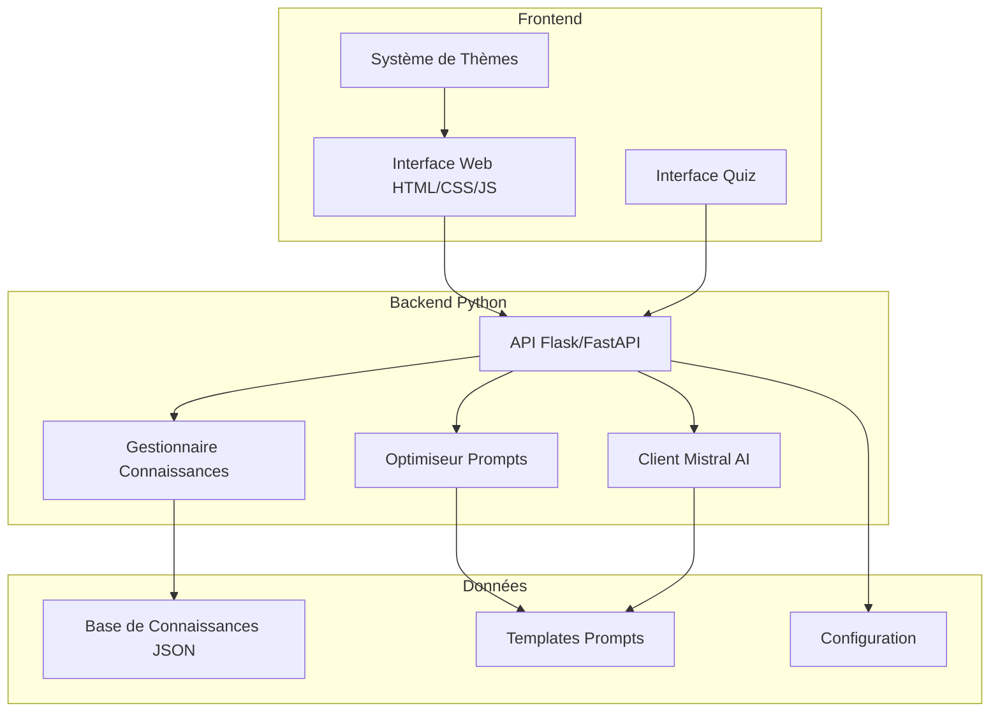

# 🏗️ Architecture du Chatbot Pédagogique Deep Learning

## Vue d'ensemble

Le chatbot pédagogique est construit selon une architecture moderne séparée en couches, permettant une maintenance facile et une évolutivité optimale.



## Architecture Détaillée

### 🎨 Couche Frontend

#### Structure des Fichiers
```
frontend/
├── index.html              # Interface principale
├── css/
│   ├── style.css           # Styles de base
│   └── themes.css          # Thèmes personnalisables
└── js/
    ├── app.js              # Logique principale
    └── quiz.js             # Module quiz (Choix B)
```

#### Composants Principaux

**1. Interface Conversationnelle**
- Zone de messages avec scroll automatique
- Champ de saisie avec auto-resize
- Indicateurs de frappe et de chargement
- Gestion de l'historique de conversation

**2. Système de Contrôles**
- Sélecteur de niveau (débutant/intermédiaire/avancé)
- Sélecteur de thème (Choix A)
- Boutons d'action (effacer, quiz, aide)

**3. Sidebar Fonctionnel**
- Historique des concepts explorés
- Barre de progression d'apprentissage
- Actions rapides (export, partage)

#### Technologies Utilisées
- **HTML5** : Structure sémantique moderne
- **CSS3** : Flexbox/Grid, variables CSS, animations
- **JavaScript ES6+** : Classes, async/await, modules
- **Fetch API** : Communication avec le backend

### ⚙️ Couche Backend

#### Structure des Fichiers
```
backend/
├── app.py                  # Application Flask principale
├── config.py               # Configuration centralisée
├── mistral_client.py       # Client API Mistral
├── knowledge_manager.py    # Gestionnaire base connaissances
└── prompt_optimizer.py     # Optimiseur prompts (Choix C)
```

#### Composants Principaux

**1. API REST (app.py)**
```python
# Endpoints principaux
GET  /                      # Informations API
GET  /health               # Santé du système
POST /api/chat             # Conversation principale
POST /api/quiz/generate    # Génération quiz
GET  /api/concepts         # Liste concepts
```

**2. Client Mistral AI (mistral_client.py)**
- Gestion sécurisée des appels API
- Cache intelligent des réponses
- Retry automatique en cas d'erreur
- Optimisation des paramètres selon le contexte

**3. Gestionnaire de Connaissances (knowledge_manager.py)**
- Chargement et validation de la base JSON
- Recherche sémantique de concepts
- Génération de quiz à partir des concepts
- Extraction de concepts depuis du texte

**4. Optimiseur de Prompts (prompt_optimizer.py)**
- Détection d'intention utilisateur
- Adaptation selon le niveau
- Enrichissement contextuel
- Templates dynamiques

#### Technologies Utilisées
- **Python 3.8+** : Langage principal
- **Flask** : Framework web léger et flexible
- **Requests** : Appels HTTP vers Mistral AI
- **JSON** : Format de données et configuration

### 📊 Couche Données

#### Base de Connaissances (knowledge_base.json)
```json
{
  "concepts": [
    {
      "id": "neural_network",
      "title": "Réseau de neurones",
      "description": "Modèle inspiré du cerveau",
      "levels": {
        "beginner": "Explication simple...",
        "intermediate": "Détails équilibrés...",
        "advanced": "Aspects techniques..."
      },
      "examples": ["Exemple 1", "Exemple 2"],
      "analogies": ["Analogie simple"],
      "related_concepts": ["deep_learning"],
      "quiz": [
        {
          "question": "Question sur le concept",
          "options": ["A", "B", "C", "D"],
          "correct_answer": 1,
          "explanation": "Pourquoi cette réponse"
        }
      ]
    }
  ]
}
```

#### Templates de Prompts (prompts_templates.json)
- Prompts système par niveau
- Templates par intention (explication, exemple, comparaison)
- Instructions de réponse adaptées
- Patterns de détection d'intention

## Flux de Données

### 1. Conversation Utilisateur
```
1. Utilisateur tape question → Frontend
2. Frontend → POST /api/chat → Backend
3. Backend analyse question → Détection intention
4. Recherche concepts pertinents → Base connaissances  
5. Enrichissement prompt → Templates
6. Appel API Mistral → Génération réponse
7. Réponse formatée → Frontend
8. Affichage réponse → Interface utilisateur
```

### 2. Génération de Quiz
```
1. Utilisateur demande quiz → Frontend
2. Frontend → POST /api/quiz/generate → Backend
3. Sélection questions → Base connaissances
4. Génération quiz adaptatif → Mistral AI (fallback)
5. Quiz structuré → Frontend
6. Interface quiz interactive → Utilisateur
```

## Patterns Architecturaux Utilisés

### 1. **MVC (Model-View-Controller)**
- **Model** : Base de connaissances, gestionnaires de données
- **View** : Interface HTML/CSS/JS
- **Controller** : API Flask, logique métier

### 2. **Repository Pattern**
- `KnowledgeManager` abstrait l'accès aux données
- Interface consistante pour les opérations CRUD
- Facilite les tests et la maintenance

### 3. **Strategy Pattern**
- `PromptOptimizer` utilise différentes stratégies selon l'intention
- Adaptation du comportement sans modification du code principal

### 4. **Observer Pattern** (Frontend)
- Système d'événements pour la communication composants
- Mise à jour automatique de l'interface

## Sécurité et Performance

### Sécurité
- **Clés API** : Stockage sécurisé via variables d'environnement
- **Validation** : Validation stricte des entrées utilisateur
- **CORS** : Configuration appropriée pour le développement
- **Rate Limiting** : Protection contre l'abus d'API

### Performance
- **Cache** : Mise en cache des réponses fréquentes
- **Lazy Loading** : Chargement différé des ressources
- **Debouncing** : Limitation des appels API répétés
- **Compression** : Optimisation des ressources statiques

## Évolutivité

### Extensions Prévues
- **Base de données** : Migration vers PostgreSQL/MongoDB
- **Authentification** : Système utilisateurs avec profils
- **Analytics** : Suivi des interactions et apprentissage
- **Multilingue** : Support de plusieurs langues

### Points d'Extension
- **Nouveaux LLM** : Interface abstraite pour d'autres APIs
- **Sources de données** : Intégration d'autres bases de connaissances  
- **Formats export** : PDF, Word, formats e-learning
- **Intégrations** : LMS, plateformes éducatives

## Configuration et Déploiement

### Variables d'Environnement
```bash
MISTRAL_API_KEY=your_api_key_here
DEBUG=True
PORT=5000
KNOWLEDGE_BASE_PATH=data/knowledge_base.json
PROMPTS_TEMPLATES_PATH=data/prompts_templates.json
```

### Déploiement Local
```bash
# Backend
cd backend
pip install -r requirements.txt
python app.py

# Frontend  
cd frontend
# Servir avec Live Server ou serveur HTTP simple
```

### Déploiement Production
- **Docker** : Conteneurisation de l'application
- **Nginx** : Proxy inverse et serveur statique
- **Gunicorn** : Serveur WSGI pour Python
- **Let's Encrypt** : Certificats SSL automatiques

## Tests et Qualité

### Types de Tests
- **Tests unitaires** : Composants individuels
- **Tests d'intégration** : Communication entre couches
- **Tests de scénarios** : Workflows utilisateur complets
- **Tests de performance** : Temps de réponse et charge

### Outils de Qualité
- **Pylint** : Analyse statique Python
- **Black** : Formatage automatique du code
- **ESLint** : Analyse statique JavaScript
- **Lighthouse** : Audit performance frontend

## Monitoring et Logs

### Logging
- Logs structurés avec différents niveaux
- Rotation automatique des fichiers de logs  
- Corrélation des requêtes avec IDs uniques

### Métriques
- Temps de réponse API
- Taux d'erreur par endpoint
- Utilisation cache et base de connaissances
- Satisfaction utilisateur (feedback)

Cette architecture garantit un système robuste, maintenable et évolutif pour l'apprentissage du Deep Learning.