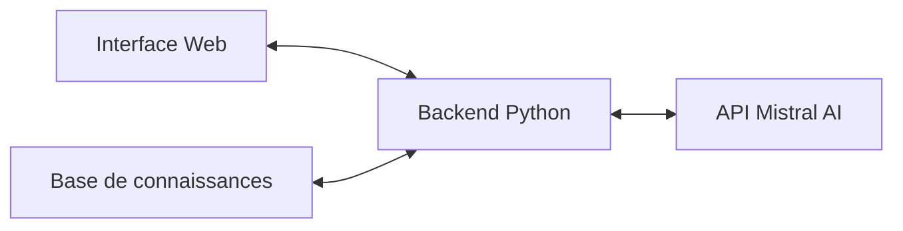

# Présentation du projet fil rouge

## Le chatbot pédagogique sur le Deep Learning

## Vision du projet

Notre projet fil rouge consiste à développer un assistant virtuel conversationnel capable d'expliquer les concepts du Deep Learning, de répondre aux questions techniques et d'accompagner les apprenants dans leur découverte de ce domaine passionnant.

> 🎯 **Objectif** : Concevoir un chatbot interactif qui aide les étudiants de BTS SIO à comprendre les concepts du Deep Learning à travers des explications personnalisées, des exemples concrets et des exercices adaptés.

## Architecture technique

Le chatbot s'appuiera sur une architecture moderne composée de trois éléments principaux :

### 1. Interface conversationnelle
- Interface web simple et intuitive
- Affichage des messages en format discussion
- Indicateur de chargement pendant le traitement
- Historique de conversation

### 2. Backend Flask/FastAPI
 - Gestion des requêtes et des sessions
 - Enrichissement des prompts avec la base de connaissances
 - Communication avec l'API Mistral
 - Logique de traitement des réponses

### 3. Intégration API Mistral AI
 - Configuration et paramètrage des requêtes
 - Gestion du contexte de conversation
 - Optimisation des prompts
 - Gestion des erreurs et limitations

### 4. Base de connaissances
 - Structure JSON organisée par concepts
  Différents niveaux d'explication (débutant à avancé)
 - Exemples et analogies adaptés
 - Exercices et quiz par thématique

## Fonctionnalités clés

Le chatbot pédagogique offrira les fonctionnalités suivantes :

1. **Explication des concepts**
    - Définition adaptée au niveau de l'utilisateur
    - Exemples concrets pour illustrer chaque notion
    - Analogies et comparaisons pour faciliter la compréhension

2. **Réponse aux questions**
    - Compréhension des questions techniques
    - Réponses précises basées sur la base de connaissances
    - Capacité à demander des clarifications si nécessaire

3. **Progression adaptative**
    - Détection du niveau de l'utilisateur
    - Suggestions de concepts à explorer ensuite
    - Augmentation progressive de la complexité

4. **Exercices interactifs**
    - Génération de quiz sur les concepts vus
    - Problèmes simples à résoudre
    - Feedback sur les réponses

## Intégration dans le parcours d'apprentissage

Le développement du chatbot est principalement concentré sur la séance 4, mais les concepts nécessaires sont présentés progressivement :

- **Séance 1** : Compréhension des réseaux de neurones nécessaire pour le contenu pédagogique
- **Séance 2** : Exploration des CNN et RNN qui constitueront le cœur de la base de connaissances
- **Séance 3** : Introduction à l'API Mistral et préparation du projet
- **Séance 4** : Développement complet, tests et présentation du chatbot

## Processus de développement

Le développement suivra une approche itérative durant la séance 4 :

| Horaire | Jalon | Livrable intermédiaire |
|---------|-------|------------------------|
| Début séance 4 | Document de conception | Structure du projet et maquette |
| +1h | Prototype initial | Interface basique + API connectée |
| +2h | Version fonctionnelle | Principales fonctionnalités implémentées |
| +3h | Version finale | Solution complète et documentation |
| +3h30 | Préparation présentation | Support visuel et démonstration |

## Défis techniques

Les principaux défis à relever seront :

1. **Prompt engineering efficace**
   - Formuler des instructions claires pour l'API Mistral
   - Maintenir la cohérence pédagogique dans les réponses
   - Éviter les hallucinations du modèle

2. **Intégration technique**
   - Communication fluide entre frontend et backend
   - Gestion asynchrone des requêtes API
   - Optimisation des temps de réponse

3. **Qualité pédagogique**
   - Structure cohérente de la base de connaissances
   - Adaptation au niveau de l'utilisateur
   - Progression logique entre les concepts

## Livrables attendus

À l'issue du projet, vous devrez présenter :

1. **Le code source complet**
   - Interface conversationnelle
   - Backend avec logique de traitement
   - Base de connaissances structurée

2. **La documentation technique**
   - Architecture du système
   - Guide d'installation et configuration
   - Description des API et interfaces

3. **Une démonstration fonctionnelle**
   - Exécution en direct
   - Présentation des fonctionnalités
   - Explication des choix techniques

## Valeur pédagogique

Ce projet constitue une application concrète et pertinente des connaissances en Deep Learning :

- **Application pratique** des concepts théoriques
- **Intégration d'une API** d'IA avancée
- **Développement full-stack** d'une solution complète
- **Structuration pédagogique** des connaissances techniques

## Ressources fournies

Pour vous aider dans ce projet, vous disposerez de :

 - [Documentation complète de l'API Mistral](ressources/api-mistral.md)
 - [Structure JSON pour la base de connaissances](ressources/json-schemas.md)
 - [Templates de code pour l'interface et le backend](ressources/code/)
 - [Exemples de prompts efficaces](ressources/prompt-examples.md)

[Retour à l'accueil](index.md){ .md-button }
[Explorer la carte de progression](carte-progression.md){ .md-button .md-button--primary }