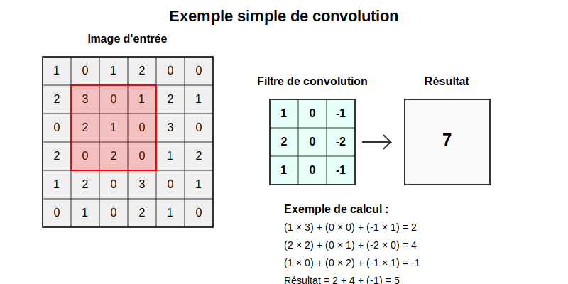
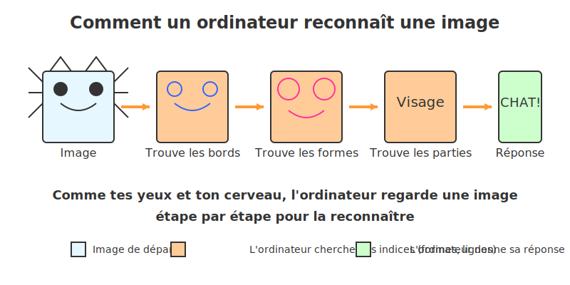

# Applications du Deep Learning
## Démonstrations pratiques

---

## Démonstration 1 : GitHub Copilot

GitHub Copilot utilise le Deep Learning pour générer des suggestions de code. Observez comment il peut :
- Entraîné sur des millions de dépôts GitHub publics
- Utilise un modèle de langage basé sur des réseaux neuronaux
- Analyse le contexte (code existant, commentaires, nom des fonctions)
- Génère des suggestions pertinentes

---

## GitHub Copilot - Exemples

**Exemple 1 : Génération à partir d'un commentaire**
```python
# Fonction qui calcule la factorielle d'un nombre n de façon récursive
def factorielle(n):
    if n <= 1:
        return 1
    else:
        return n * factorielle(n-1)
```

**Exemple 2 : Complétion de code existant**
```python
def trier_par_age(personnes):
    # Trie la liste de personnes par âge croissant
    return sorted(personnes, key=lambda personne: personne['age'])
```

---

## GitHub Copilot - Exemples (suite)

**Exemple 3 : Génération de tests**
```python
# Tests unitaires pour la fonction factorielle
def test_factorielle():
    assert factorielle(0) == 1
    assert factorielle(1) == 1
    assert factorielle(5) == 120
    assert factorielle(10) == 3628800
```

---

## Réflexion : Impact sur le développement logiciel

- Comment ces outils changent-ils la nature du travail de développeur ?
- Quelles compétences deviennent plus importantes ?
- Limites et risques potentiels ?

---

## Démonstration 2 : Reconnaissance d'objets

Une application de Deep Learning peut identifier des objets dans des photos ou vidéos en temps réel :

- Nous allons utiliser l'application [Teachable Machine](https://teachablemachine.withgoogle.com/) 
- Observez la détection en temps réel des objets présents dans la salle
- Notez le niveau de confiance (pourcentage) pour chaque prédiction

### Comment ça fonctionne ?

- Utilise des réseaux neuronaux convolutifs (CNN)
- Entraîné sur des millions d'images labellisées
- Détecte les caractéristiques visuelles à différents niveaux d'abstraction
- Identifie et localise les objets dans l'image

---

## Reconnaissance d'objets - Observation

### Ce que nous allons observer
- Reconnaissance en temps réel
- Niveau de confiance des prédictions
- Robustesse face aux variations (angle, éclairage)


- Le modèle identifie plusieurs objets simultanément
- Chaque objet est encadré et étiqueté
- Un score de confiance est associé à chaque prédiction

---

## Qu'est-ce que la convolution ?



- Le filtre se déplace sur l'image et effectue des calculs à chaque position
- Chaque case du filtre est multipliée par la case correspondante de l'image
- Les résultats sont additionnés pour obtenir une seule valeur
- Cette opération se répète pour créer une nouvelle "carte de caractéristiques"

---

## Fonctionnement interne d'un CNN

1. **Convolution** : application de filtres pour détecter des caractéristiques
2. **Pooling** : réduction de la dimension spatiale
3. **Activation** : introduction de non-linéarité (ReLU)
4. **Classification** : couches entièrement connectées pour la prédiction

Ces opérations permettent d'extraire automatiquement des caractéristiques de plus en plus abstraites.

---

## Comment un CNN reconnaît les images



- L'ordinateur analyse l'image étape par étape, comme notre cerveau
- Il détecte d'abord les contours simples, puis les formes
- Il combine ces informations pour comprendre ce qu'il "voit"
- De simples pixels à une identification complète

---

## Démonstration 3 : Génération de texte

Les modèles de langage utilisent des réseaux neuronaux pour générer du texte cohérent :
- outil populaire pour l'expérimentation et l'analyse de données
- Nous allons utiliser un modèle simplifié de génération de texte
- Donnez une amorce (début de phrase ou paragraphe)
- Observez comment le modèle complète le texte de manière cohérente
- Essayez avec différents styles : formel, informel, technique, créatif

### Comment ça fonctionne ?
- Utilise des modèles de langage comme GPT ou Mistral
- Entraîné sur d'énormes corpus de texte
- Apprend les patterns statistiques du langage
  
Cette technologie repose sur des modèles de type Transformer qui utilisent des mécanismes d'attention pour :
1. Analyser les relations entre les mots et leur contexte
2. Prédire les tokens (mots/parties de mots) les plus probables
3. Construire progressivement un texte cohérent

---

## Génération de texte - Observation

### Ce que nous allons observer
- Complétion de texte à partir d'une amorce
- Adaptation au style et au contexte
- Cohérence à court et moyen terme

### Interfaces de démonstration
- Demo Mistral AI : https://mistral.ai/
- GPT-3.5/Claude via Poe : https://poe.com/

---

## Exemples d'amorces à tester

**Exemple 1 : Style technique (informatique)**
```
Les réseaux de neurones convolutifs sont particulièrement efficaces pour 
```

**Exemple 2 : Style créatif (narration)**
```
Dans les profondeurs de l'océan, un étrange phénomène lumineux attira l'attention des chercheurs qui
```

---

## Exemples d'amorces à tester (suite)

**Exemple 3 : Style formel (business)**
```
L'intégration de l'intelligence artificielle dans le processus client permet aux entreprises de
```

**Exemple 4 : Style instructif (tutoriel)**
```
Pour développer une application web en React, suivez ces étapes :
```

---

## Points à observer pendant la démonstration

1. **Cohérence contextuelle** : Comment le modèle maintient le sujet et le contexte
2. **Adaptation au style** : Comment le ton et le vocabulaire s'adaptent à l'amorce
3. **Connaissances intégrées** : Informations factuelles que le modèle peut restituer
4. **Limitations** : Moments où le modèle peut générer des informations incorrectes

---

## Application en développement SLAM

En tant que développeurs, vous pourriez intégrer cette technologie pour :
- Générer automatiquement des descriptions de produits
- Créer des assistants virtuels pour guider les utilisateurs
- Produire des résumés de documents techniques
- Proposer des suggestions de réponses dans une application de service client

---

## Ce que ces applications ont en commun

- Basées sur des architectures de réseaux neuronaux avancées
- Entraînées sur d'énormes volumes de données
- Capables d'extraire automatiquement des patterns complexes
- Produisent des résultats qui semblent "intelligents"