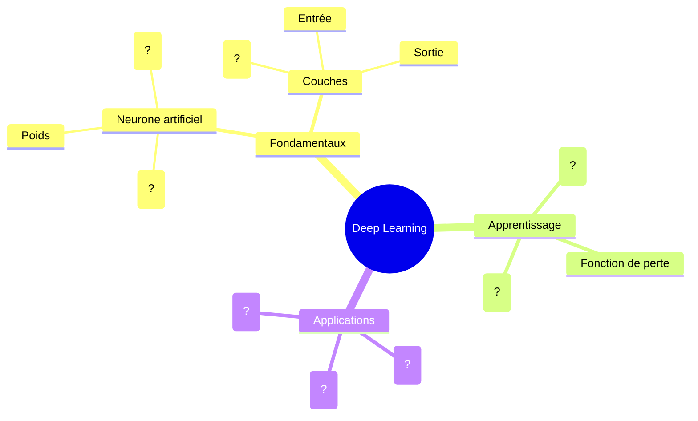

# Auto-évaluation : Séance 1

## Consolidation des acquis sur le Deep Learning

Cette auto-évaluation vous permettra de faire le point sur les connaissances et compétences acquises lors de cette première séance sur le Deep Learning. Elle vous aidera également à identifier les points à approfondir pour la suite du parcours.

## 1. Évaluation des connaissances fondamentales

### Terminologie du Deep Learning

Associez chaque terme à sa définition correcte en traçant des liens :

| Terme | Définition |
|-------|------------|
| Neurone artificiel | A. Algorithme d'optimisation qui ajuste progressivement les poids pour minimiser l'erreur |
| Couche cachée | B. Paramètre ajustable qui détermine l'importance de chaque entrée d'un neurone |
| Poids (weight) | C. Fonction non-linéaire appliquée à la somme pondérée pour introduire de la complexité |
| Biais (bias) | D. Unité de calcul qui applique une fonction d'activation à une somme pondérée d'entrées |
| Fonction d'activation | E. Couche située entre la couche d'entrée et la couche de sortie d'un réseau |
| Descente de gradient | F. Paramètre supplémentaire qui permet au neurone de s'activer même si toutes les entrées sont nulles |

*Réponses : D, E, B, F, C, A*

### Compréhension des concepts

Évaluez votre compréhension en répondant à ces questions :

1. **Quelle est la principale différence entre le Machine Learning classique et le Deep Learning ?**
   - [ ] Le Deep Learning est plus rapide à entraîner
   - [ ] Le Deep Learning extrait automatiquement les caractéristiques pertinentes
   - [ ] Le Deep Learning nécessite moins de données
   - [ ] Le Deep Learning est toujours plus précis

2. **Pourquoi utilise-t-on des fonctions d'activation non-linéaires dans les réseaux de neurones ?**
   - [ ] Pour accélérer l'entraînement
   - [ ] Pour permettre au réseau d'apprendre des relations complexes non-linéaires
   - [ ] Pour réduire le nombre de paramètres
   - [ ] Pour éviter le surapprentissage

3. **Qu'est-ce qui permet à un réseau de neurones d'apprendre ?**
   - [ ] L'augmentation progressive du nombre de neurones
   - [ ] L'ajustement des poids en fonction des erreurs commises
   - [ ] La modification automatique de l'architecture
   - [ ] L'addition de couches au fur et à mesure de l'entraînement

## 2. Compétences pratiques

Évaluez vos compétences pratiques acquises durant cette séance :

| Compétence | Débutant | Intermédiaire | Avancé |
|------------|----------|---------------|--------|
| Manipulation d'un notebook Google Colab | | | |
| Compréhension du fonctionnement d'un neurone | | | |
| Visualisation du flux d'information dans un réseau | | | |
| Modification des hyperparamètres et observation des effets | | | |
| Comparaison des approches ML classique vs DL | | | |

*Cochez la case correspondant à votre niveau pour chaque compétence*

## 3. Réflexion personnelle

Prenez quelques minutes pour réfléchir à votre apprentissage :

1. **Les concepts qui me semblent les plus clairs :**
   
   _[Votre réponse ici]_

2. **Les points que je dois encore approfondir :**
   
   _[Votre réponse ici]_

3. **Ce qui m'a le plus surpris ou intéressé :**
   
   _[Votre réponse ici]_

4. **Comment je pourrais appliquer ces connaissances :**
   
   _[Votre réponse ici]_

## 4. Préparation à la prochaine séance

Pour préparer efficacement la séance 2 sur les types de réseaux de neurones et leurs applications, je devrais :

- [ ] Revoir les concepts fondamentaux des réseaux de neurones
- [ ] Explorer les ressources supplémentaires sur les CNN et RNN

## 5. Carte mentale des concepts clés

Complétez cette carte mentale en reliant les concepts et en ajoutant les termes manquants :

## 6. Évaluation par les pairs (optionnel)

Si vous travaillez en binôme, prenez un moment pour échanger vos auto-évaluations et discuter de vos perceptions respectives :

| Question | Réponse du partenaire |
|----------|----------------------|
| Quels concepts ai-je bien expliqués ? | |
| Quels concepts devrais-je approfondir ? | |
| Suggestions pour améliorer ma compréhension | |

## Ressources pour approfondir

Si vous souhaitez consolider certains concepts avant la prochaine séance :

- [Neural Networks and Deep Learning](http://neuralnetworksanddeeplearning.com/) - Un livre en ligne gratuit (en anglais)
- [Playground TensorFlow](https://playground.tensorflow.org/) - Une visualisation interactive des réseaux de neurones
- [3Blue1Brown: Neural Networks](https://www.youtube.com/playlist?list=PLZHQObOWTQDNU6R1_67000Dx_ZCJB-3pi) - Une excellente série de vidéos explicatives

---

Cette auto-évaluation est à compléter individuellement. Vous pouvez la soumettre à votre formateur pour obtenir des retours personnalisés ou la conserver comme référence personnelle pour suivre votre progression.

[Passer à la Séance 2](../seance2/index.md){ .md-button .md-button--primary }