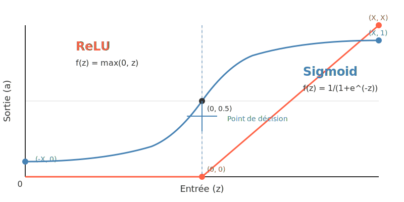

# Les bases du Deep Learning : une approche simplifiée

## Introduction

Ce document présente les concepts fondamentaux du Deep Learning de manière accessible, sans les mathématiques complexes. Notre objectif est de vous donner une compréhension intuitive du fonctionnement des réseaux de neurones.

## 1. Le neurone artificiel : comprendre la brique de base

### Comment fonctionne un neurone artificiel ?

Un neurone artificiel s'inspire du fonctionnement des neurones biologiques. Il combine plusieurs informations d'entrée pour produire une décision.

**Fonctionnement en 5 étapes :**

1. **Recevoir des entrées** : Le neurone reçoit plusieurs valeurs (comme la taille et le poids d'un fruit)
2. **Pondérer ces entrées** : Certaines entrées sont plus importantes que d'autres (le poids peut être plus déterminant que la taille)
3. **Faire la somme** : Additionner toutes ces valeurs pondérées
4. **Ajouter un décalage (biais)** : Ajuster le seuil de décision
5. **Appliquer une fonction d'activation** : Transformer cette somme en une sortie utile

**Analogie :** Si vous décidez d'acheter un téléphone, vous considérez plusieurs facteurs (prix, performances, appareil photo) avec différentes importances. Vous additionnez mentalement ces considérations, puis prenez une décision (acheter ou non).

### La fonction d'activation : le pouvoir de décision

La fonction d'activation est comme un interrupteur qui détermine si le neurone "s'active" ou non.

**Types principaux :**

1. **ReLU (Rectified Linear Unit)** : 
   - Simple : si le nombre est négatif, il devient 0; sinon, il reste inchangé
   - Comme un interrupteur qui ne laisse passer que les valeurs positives

2. **Sigmoid** : 
   - Transforme n'importe quel nombre en une valeur entre 0 et 1
   - Pratique pour exprimer des probabilités (ex: probabilité que l'image contienne un chat)

**Visualisation :**

## 2. Le réseau de neurones : une équipe organisée

Un réseau de neurones est simplement une organisation de neurones en couches qui travaillent ensemble.

### Organisation en couches

- **Couche d'entrée** : Reçoit les données brutes (pixels d'une image, mots d'un texte...)
- **Couches cachées** : Traitent l'information de façon de plus en plus abstraite
- **Couche de sortie** : Donne le résultat final (classification, prédiction...)

**Analogie :** Dans une entreprise, les informations passent par plusieurs services avant d'aboutir à une décision finale. Chaque service (couche) traite l'information à son niveau.

### Comment l'information circule

1. Les données entrent par la première couche
2. Chaque neurone calcule sa sortie et la transmet aux neurones de la couche suivante
3. L'information se propage ainsi jusqu'à la couche de sortie

C'est ce qu'on appelle la **propagation avant** ou "forward propagation".

## 3. L'apprentissage : comment le réseau devient intelligent

### Le principe de base

L'apprentissage d'un réseau de neurones se résume à :
1. Faire des prédictions
2. Mesurer les erreurs
3. Ajuster les poids pour réduire ces erreurs
4. Recommencer

### Mesurer l'erreur

Pour savoir si le réseau fait bien son travail, on calcule la différence entre :
- Ce que le réseau prédit
- Ce qu'il aurait dû prédire (la vérité)

Plus cette différence est petite, meilleur est le réseau.

**Exemple :** Si le réseau prédit qu'une image a 80% de chances de contenir un chat alors qu'il y a effectivement un chat, l'erreur est de 20%.

### L'ajustement des poids : la descente de gradient

Pour améliorer le réseau, on ajuste les poids dans la bonne direction :

1. On détermine si chaque poids doit être augmenté ou diminué
2. On modifie chaque poids d'un petit pas dans la bonne direction
3. On vérifie si la prédiction s'améliore

**Analogie :** Imaginez que vous êtes dans le brouillard en montagne et que vous voulez descendre. Vous tâtez le terrain autour de vous pour sentir où ça descend, puis vous faites un pas dans cette direction. Vous répétez jusqu'à atteindre le fond de la vallée.

### Rétropropagation : distribuer la responsabilité

Quand le réseau fait une erreur, comment savoir quels poids ajuster ? La **rétropropagation** consiste à :

1. Calculer l'erreur à la sortie
2. "Remonter" cette erreur dans le réseau
3. Déterminer la contribution de chaque connexion à l'erreur totale
4. Ajuster chaque poids en conséquence

**Analogie :** Dans une équipe qui a commis une erreur, on analyse la responsabilité de chaque membre pour savoir qui doit ajuster son comportement et comment.

## 4. Les architectures populaires simplifiées

### Les réseaux convolutifs (CNN) pour les images

Les CNN sont spécialement conçus pour traiter des images :

- Ils utilisent des "filtres" qui balayent l'image pour détecter des motifs
- Les premières couches détectent des éléments simples (lignes, coins)
- Les couches suivantes combinent ces éléments pour reconnaître des formes plus complexes (yeux, visages, objets)

**Analogie :** C'est comme si vous regardiez une image avec différentes loupes, chacune spécialisée pour repérer un certain type de détail.

### Les réseaux récurrents (RNN) pour les séquences

Les RNN sont adaptés aux données séquentielles (texte, parole, vidéo) :

- Ils ont une "mémoire" qui conserve les informations importantes des étapes précédentes
- Cette mémoire permet de comprendre le contexte (comme le sens d'un mot en fonction des mots précédents)

**Analogie :** C'est comme lire un livre en se souvenant des chapitres précédents pour comprendre le chapitre actuel.

## 5. Astuces pour améliorer les réseaux

### La régularisation : éviter le "par cœur"

Parfois, un réseau apprend trop bien les exemples d'entraînement mais ne généralise pas aux nouveaux cas. C'est le **surapprentissage**.

La régularisation est comme imposer des contraintes au réseau pour l'empêcher de trop se spécialiser :

- **Dropout** : Désactiver aléatoirement certains neurones pendant l'entraînement
- **L1/L2** : Pénaliser les poids trop grands

**Analogie :** C'est comme étudier pour un examen en variant les conditions d'étude pour s'assurer de comprendre le concept et pas juste mémoriser.

### Le taux d'apprentissage : la taille des pas

Le taux d'apprentissage détermine l'ampleur des ajustements à chaque étape :
- Trop grand : on risque de "sauter" par-dessus la solution
- Trop petit : l'apprentissage est très lent

**Analogie :** C'est comme régler la sensibilité du volant d'une voiture - trop sensible et vous zigzaguez, pas assez et vous tournez trop lentement.

## Conclusion

Vous avez maintenant une compréhension intuitive des concepts fondamentaux du Deep Learning :

1. Les neurones artificiels combinent et transforment les informations
2. Les réseaux organisent ces neurones en couches pour traiter l'information progressivement
3. L'apprentissage consiste à ajuster les poids pour minimiser les erreurs
4. Différentes architectures sont spécialisées pour différents types de données
5. Des techniques spécifiques permettent d'améliorer les performances

Cette approche simplifiée vous donne les bases nécessaires pour comprendre les discussions sur le Deep Learning et pour explorer plus en profondeur si vous le souhaitez.

## Pour aller plus loin

Si ces concepts vous intéressent, vous pouvez explorer :

- [TensorFlow Playground](https://playground.tensorflow.org/) - Visualiser et expérimenter avec des réseaux de neurones simples
- [3Blue1Brown - Neural Networks](https://www.youtube.com/playlist?list=PLZHQObOWTQDNU6R1_67000Dx_ZCJB-3pi) - Série de vidéos avec d'excellentes visualisations
- [Machine Learning for Beginners](https://github.com/microsoft/ML-For-Beginners) - Cours de Microsoft avec approche pratique

[Retour aux ressources](index.md){ .md-button }