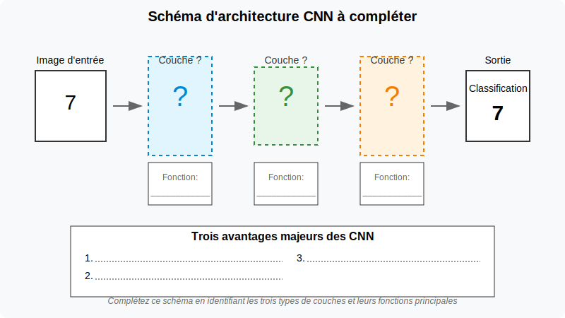

Je vais créer un SVG qui montre une image comparative pour illustrer le traitement des données dans un CNN.

## Partie 1: Exploration des principes des CNN (20 min)

### Défi de réflexion initiale

Avant de plonger dans les CNN, prenez 2 minutes pour réfléchir à cette question :
> **Question à méditer** : Comment reconnaissez-vous un visage dans une photo, quelle que soit sa position ou l'éclairage ? Qu'est-ce qui rend cette tâche si facile pour vous et si difficile pour un ordinateur ?

### Activité guidée : Découverte de l'architecture CNN

**Étape 1 : Observation (3 min)**
Examinez ces deux visualisations en parallèle :
- L'image originale d'un chiffre '7' manuscrit et son traitement par les différentes couches d'un CNN

- Les différentes caractéristiques extraites à chaque niveau d'un CNN déjà entraîné

**Étape 2 : Mini-investigation (5 min)**
Formez des binômes et discutez :
- Que semble détecter la première couche du réseau ? (contours, textures...)
- Comment évoluent les formes détectées en avançant dans le réseau ?
- Pourquoi le réseau semble-t-il "simplifier" l'image à chaque étape ?

**Étape 3 : Construction du modèle mental (5 min)**
Sur votre feuille de travail, complétez le schéma simplifié d'un CNN :

1. Identifiez et nommez les trois types principaux de couches
2. Pour chaque type, précisez brièvement sa fonction
3. Listez les trois avantages majeurs des CNN

**Étape 4 : Analogie concrète (3 min)**
Imaginez que vous êtes un inspecteur cherchant à identifier un suspect :
- La **couche de convolution** est comme votre attention aux détails spécifiques (cicatrice, forme du nez...)
- La **couche de pooling** est comme votre capacité à ignorer les éléments non pertinents (éclairage, angle de vue...)
- La **couche fully connected** est comme votre processus de décision finale ("C'est lui !")

### Validation collective (4 min)

Comparez votre schéma avec celui de vos voisins et discutez des trois avantages majeurs des CNN pour un développeur d'applications :
- Pourquoi est-ce important de réduire le nombre de paramètres ?
- Comment l'invariance à la translation facilite-t-elle la reconnaissance d'objets ?
- Pourquoi l'extraction automatique de caractéristiques est-elle révolutionnaire ?

### Transition vers l'implémentation

Maintenant que vous avez conceptualisé l'architecture d'un CNN, passons à l'implémentation pratique pour voir ces concepts en action. Gardez votre schéma à portée de main - vous pourrez le compléter avec des observations pratiques.