# Séance 3 : Frameworks pratiques et préparation du projet


## Objectifs de la séance

Cette troisième séance vous permettra de :

- Découvrir les frameworks de Deep Learning utilisés en entreprise
- Acquérir des compétences pratiques avec TensorFlow/Keras
- Apprendre à améliorer les performances de vos modèles simplement
- Préparer la conception du chatbot pédagogique pour votre projet
- S'initier à l'API Mistral AI pour créer des applications concrètes

## Approche pédagogique

Cette séance est résolument orientée vers les compétences pratiques. Vous découvrirez les outils industriels de Deep Learning et apprendrez à les utiliser dans des situations concrètes. Les exercices sont conçus pour développer des compétences directement transférables en milieu professionnel.

## Structure de la séance (4h)

```mermaid
gantt
    dateFormat  HH:mm
    axisFormat %H:%M
    section Planning
    Frameworks pour débutants        :milestone, 00:00, 1h30m
    Amélioration des performances    :milestone, 01:30, 1h30m
    Pause                        :milestone, 03:00, 15m
    Préparation du projet final  :milestone, 03:15, 45m
```



## Trois phases d'apprentissage

Cette séance est structurée en trois phases complémentaires :

### [Phase 1 : Frameworks pour débutants](partie1-frameworks-debutants.md) (1h30)

Découvrez les outils qui vous permettront de créer des applications d'IA sans complexité excessive.

- Installation et configuration de base de TensorFlow/Keras
- Utilisation de modèles pré-entraînés pour des tâches courantes
- Mini-projet : développer une API de reconnaissance d'images simple

### [Phase 2 : Amélioration des performances](partie2-amelioration.md) (1h30)

Apprenez à améliorer vos modèles d'IA sans avoir besoin de connaissances mathématiques avancées.

- Techniques simples d'optimisation des performances
- Bonnes pratiques pour éviter les erreurs courantes
- TP pratique : améliorer un modèle existant pour une application web

### [Phase 3 : Préparation au projet final](partie3-preparation-projet.md) (45min)

Commencez à développer votre chatbot pédagogique en utilisant des technologies accessibles.

- Présentation d'un cahier des charges adapté au niveau BTS SIO
- Étude de cas réels d'entreprises utilisant des chatbots similaires
- Premiers pas avec l'API Mistral AI pour créer un prototype fonctionnel

## Ressources nécessaires

Pour cette séance, vous aurez besoin de :

- Un ordinateur avec une connexion internet
- Un compte Google pour accéder à Google Colab (pas d'installation complexe requise)
- Les notebooks préparés avec des exemples de code commentés étape par étape
- Les templates de projets à compléter (approche "fill in the blanks")
- Une clé API Mistral gratuite (instructions de création fournies)

## Livrables attendus

À l'issue de cette séance, vous devrez avoir produit :

- Une API simple de reconnaissance d'images fonctionnelle (utilisable en contexte professionnel)
- Un modèle amélioré pour une application web concrète (documenté pour un transfert à un collègue)
- Un document de conception pour votre chatbot avec les fonctionnalités essentielles priorisées

Ces livrables serviront de base pour la dernière séance et sont à déposer dans l'espace prévu avant la date limite.

## Prêt à commencer ?

Commencez par la première phase pour découvrir comment utiliser les frameworks de Deep Learning de manière accessible et orientée projet.

[Commencer la Phase 1](partie1-frameworks-debutants.md){ .md-button .md-button--primary }
```

