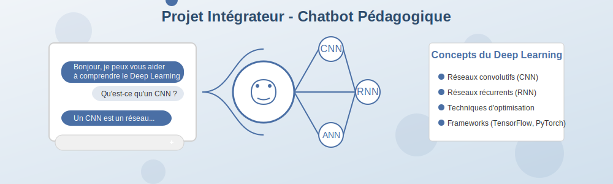

# Séance 4 : Projet intégrateur - Chatbot pédagogique

## Objectifs de la séance

Cette dernière séance vous permettra de :

- Appliquer l'ensemble des connaissances acquises dans un projet concret et complet
- Développer un chatbot pédagogique fonctionnel expliquant le Deep Learning
- Intégrer l'API Mistral AI dans une solution complète
- Présenter et défendre votre solution technique

## Approche pédagogique

Cette séance est entièrement basée sur la réalisation d'un projet concret en équipe. Vous devrez mobiliser toutes les compétences développées lors des séances précédentes pour créer une application complète et fonctionnelle. L'accent est mis sur l'autonomie, la collaboration et la mise en pratique professionnelle.

## Structure de la séance (4h)

## Trois phases de réalisation

### [Phase 1 : Développement du chatbot](partie1-developpement.md) (2h30)

Implémentez les fonctionnalités principales de votre chatbot pédagogique :

- Mise en place de l'interface conversationnelle
- Intégration avancée avec l'API Mistral AI
- Structuration et enrichissement de la base de connaissances
- Développement des fonctionnalités d'aide à l'apprentissage

### [Phase 2 : Finalisation et tests](partie2-finalisation.md) (1h)

Peaufinez votre solution et assurez-vous de sa qualité :

- Tests fonctionnels et scénarios d'utilisation
- Optimisation des performances
- Documentation technique et guide utilisateur
- Préparation de la démonstration

### [Phase 3 : Présentation des projets](partie3-presentation.md) (30min)

Présentez votre solution à la classe :

- Démonstration en direct du chatbot
- Explication des choix techniques
- Retour sur les défis rencontrés et les solutions adoptées
- Questions-réponses

## Ressources nécessaires

Pour cette séance, vous aurez besoin de :

- Votre document de conception préparé lors de la séance 3
- Compte et clé API Mistral AI
- Environnement de développement (Google Colab ou local)
- Templates fournis pour la documentation

## Livrables attendus

À l'issue de cette séance, vous devrez remettre :

1. **Code source complet** du chatbot pédagogique
2. **Base de connaissances structurée** sur le Deep Learning
3. **Documentation technique** expliquant l'architecture et les choix d'implémentation
4. **Guide utilisateur** pour la prise en main
5. **Présentation** avec support à fournir

Ces livrables constituent l'aboutissement de votre parcours et seront évalués selon les critères détaillés dans la [grille d'évaluation](../evaluation/criteres-evaluation-seance4.md).

## Prêt à relever le défi ?

C'est l'heure de mettre en pratique tout ce que vous avez appris pour créer un outil réellement utile. Bonne chance !

[Commencer la Phase 1](partie1-developpement.md){ .md-button .md-button--primary }